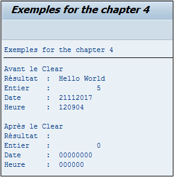

# **`CLEAR`**

```JS
CLEAR dobj.
```

Le `CLEAR` instruction commune à tous les types de variables (chaîne de caractères, numérique...) qui permet tout simplement de supprimer leur contenu.

Cet exemple permet de faire un CLEAR sur des variables de différents types et de les afficher. Il permet de voir également les valeurs par défaut de chaque type.

```JS
DATA: v_result(50) TYPE c,
      v_int(5)     TYPE i,
      v_date       TYPE d,
      v_hour       TYPE t.

v_result = 'Hello World'.
v_int    = 5.
v_date   = sy-datum.
v_hour   = sy-uzeit.

WRITE:/ 'Avant le Clear'.
WRITE:/ 'Résultat  : ', v_result.
WRITE:/ 'Entier    : ', v_int.
WRITE:/ 'Date      : ', v_date.
WRITE:/ 'Heure     : ', v_hour.

CLEAR: v_result,
       v_int,
       v_date,
       v_hour.

WRITE:/.
WRITE:/ 'Après le Clear'.
WRITE:/ 'Résultat  : ', v_result.
WRITE:/ 'Entier    : ', v_int.
WRITE:/ 'Date      : ', v_date.
WRITE:/ 'Heure     : ', v_hour.
```


