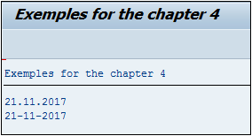

# **`REORGANISER`**

```JS
Variable[+pos](nbre)
```

Afin de pouvoir `extraire` ou `réorganiser` une chaîne de caractères, cette instruction permet de faire une sélection à partir d’une position `pos` sur un nombre de caractères définis `nbre`

La date [sy-datum](../99_Help/02_SY-SYSTEM.md) sur `SAP` adopte le format `AAAAMMJJ` Comment faire afin qu’elle réponde au schéma `JJ-MM-AAAA`. Pour ceci, l’instruction `CONCATENATE` sera également utilisée.

_Exemple_

```JS
DATA: v_date(10) TYPE c.

CONCATENATE sy-datum+6(2)
            sy-datum+4(2)
            sy-datum(4) INTO v_date SEPARATED BY '-'.

CONDENSE v_date NO-GAPS.

WRITE:/ sy-datum,
      / v_date.
```

Une variable `V_DATE` est déclarée de type chaîne de caractères de dix positions afin de pouvoir stocker la date finale, puis la date système [sy-datum](../99_Help/02_SY-SYSTEM.md) sera travaillée de la façon suivante :

- `SY-DATUM+6(2)` : à la sixième position, prendre deux caractères afin d’obtenir le jour.
- `SY-DATUM+4(2)` : à la quatrième position, prendre deux caractères afin d’extraire le mois.
- `SY-DATUM(4)` : prendre les quatre premiers caractères pour l’année.

Tout ceci sera concaténé (`CONCATENATE`) `INTO V_DATE` avec SEPARATED BY `-`, puis par précaution, tous les espaces seront retirés (`CONDENSE... NO-GAPS`).

_Le résultat final ressemblera au format espéré :_



Pour rappel, la première position d’une chaîne de caractères commence toujours par 0 !
