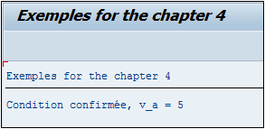
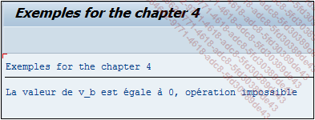
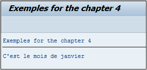

# **`IF ... ENDIF`**

```JS
IF log_exp1.
  [statement_block1]
[ELSEIF log_exp2.
  [statement_block2]]
...
[ELSE.
  [statement_blockn]]
ENDIF.
```

L’instruction `IF` est une condition permettant de contrôler et de comparer une variable selon une valeur ou une autre variable, et d’exécuter un traitement si la condition est vraie.

_Exemple_

```JS
DATA: v_a TYPE i,
      v_b TYPE i,
      v_c TYPE i.

v_b = 3.
V_c = 2.

v_a = v_b + v_c.

IF v_a = 5.
  WRITE:/ 'Condition confirmée, v_a = 5'.
ENDIF.
```

Trois variables ont été créées, `V_A`, `V_B` et `V_C` de type entier. `V_B` prend la valeur `3`, `V_C`, la valeur `2`, quant à `V_A` elle est la somme de `V_B` et `V_C`. Vient ensuite une condition, comparant la variable `V_A` avec la valeur `5`. Si cette condition est valide, le texte `Condition confirmée, v_a = 5` sera affiché.



L’opérateur de comparaison de cette condition est le signe égal (=) mais d’autres existent également sur SAP.

## **OPERATEURS DE COMPARAISON**

Les opérateurs de comparaison suivants peuvent être utilisés pour tous les types de données, que ce soit pour des valeurs numériques, alphanumériques ou même du texte.

Opérateurs de comparaison pour tout type de données :

| **`Opération`**           | **``Signe** | **`Keyword`** | **`Signification`** |
| ------------------------- | ----------- | ------------- | ------------------- |
| `Egal`                    | =           | `EQ`          | EQual               |
| `Strictement supérieur à` | >           | `GT`          | Greater Than        |
| `Supérieur ou égal à`     | >=          | `GE`          | Greatrer or Equal   |
| `Strictement inférieur à` | <           | `LT`          | Lower Than          |
| `Inférieur ou égal à`     | <=          | `LE`          | Lower or Equal      |
| `Différent`               | <>          | `NE`          | Not Equal           |

## **DUMP**

Il a été vu que l’exécution d’un programme pouvait s’arrêter brutalement et retourner un dump dû à une division par zéro par exemple.

_Exemple d’un code retournant un dump lors de l’exécution :_

```JS
DATA: v_a      TYPE i,
      v_b      TYPE i,
      v_result TYPE i.

v_a = 5.
v_b = 0.

v_result = v_a / v_b.
WRITE v_result.
```

Trois variables de type entier ont été créées : `V_A`, `V_B` et `V_RESULT`. La variable `V_A` va contenir la valeur `5` alors que `V_B` sera égale à `0`. La division `V_A` par `V_B` sera ensuite exécutée et stockée dans la variable `V_RESULT`, qui sera par la suite affichée.

Pour éviter que le programme s’arrête brutalement en `dump`, il suffira de tester la valeur de `V_B` et de s’assurer qu’elle soit strictement supérieure à `0`. Un `ELSE` sera également ajouté afin d’afficher un message d’erreur si la condition n’est pas respectée.

```JS
DATA: v_a      TYPE i,
      v_b      TYPE i,
      v_result TYPE i.

v_a = 5.
v_b = 0.

IF v_b > 0.
  v_result = v_a / v_b.
  WRITE v_result.
ELSE.
  WRITE 'La valeur de v_b est égale à 0, opération impossible'.
ENDIF.
```



## **ELSEIF**

La condition `IF` peut intégrer une variante avec le `ELSEIF` pouvant par exemple tester les différentes valeurs de la variable `V_MONTH` contenant le mois de la date système [sy_datum](../99_Help/02_SY-SYSTEM.md), et afficher un texte adéquat :

```JS
DATA v_month TYPE i.

v_month = sy-datum+4(2).

IF v_month = 1.
  WRITE:/'C''est le mois de janvier'.
ELSEIF v_month = 2.
  WRITE:/'C''est le mois de février'.
ELSEIF v_month = 3.
  WRITE:/'C''est le mois de mars'.
ELSEIF v_month = 4.
  WRITE:/'C''est le mois d''avril'.
ELSEIF v_month = 5.
  WRITE:/'C''est le mois de mai'.
ELSE.
  WRITE:/'Autre mois de l''année'.
ENDIF.
```


