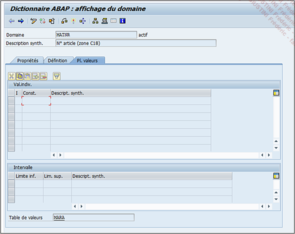

# **`PLAGE DE VALEURS`**

Le dernier onglet `Pl. Valeurs` pour `Plage de Valeurs`. Cette partie est divisée en trois sous-parties :

- `Valeur individuelle`
- `Intervalle`
- `Table de valeurs`

Lorsqu’un `champ` utilisant ce `domaine` est mis à jour (par exemple lorsqu’une facture est éditée et que la liste des matériaux est dressée), le programme ira vérifier si la valeur existe comme valeur individuelle ou dans l’intervalle défini, ou dans la table de valeurs.

Dans le cas du `n° d’article`, il utilise la table de valeurs `MARA`. Un double clic permet d’afficher le détail de celle-ci. Ainsi, le champ `MATNR` utilise l’élément de données `MATNR` (voir section suivante Éléments de données) qui utilise à son tour le domaine `MATNR`, et est défini en tant que clé de cette table (cette notion sera développée dans la section Structures et Tables de ce chapitre).

De cette façon, à chaque fois qu’un utilisateur emploiera un numéro d’article, `SAP` ira voir dans cette table si la valeur renseignée existe bien. Dans le cas contraire, il retournera un message d’erreur invitant l’utilisateur à soit utiliser un autre article, soit créer celui qu’il voudrait employer.
