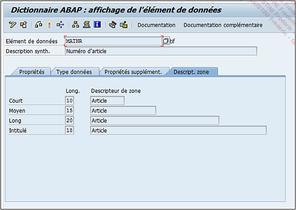

# **`DESCRIPTION DE ZONE`**

Enfin, la dernière caractéristique permet de `nommer` les colonnes des champs utilisant l’élément de données.

Trois zones sont utilisées pour le nom des colonnes (`Court`/`Moyen`/`Long`) et une quatrième pour le titre. Dans l’exemple, elles portent toutes le même nom, mais peuvent bien évidemment être différentes en tenant compte de la longueur maximum de caractères (10 pour le texte court, 20 pour le moyen, 40 pour le long et 55 pour l’intitulé).
