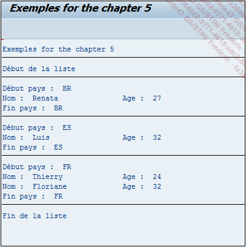

# **`PARAMETRE AT`**

_Concernant les paramètres `AT`, il en existe plusieurs :_

```JS
LOOP AT itab.
  [AT FIRST.
    ...
  ENDAT.]

  [AT NEW comp1.
    ...
  ENDAT.

  [AT NEW comp2.
    ...
  ENDAT.
  [...]
  [AT NEW compn.
    ...
  ENDAT.

  [...]

  [AT END OF compn.
    ...
  ENDAT.
  [...]
  [AT END OF comp2.
    ...
  ENDAT.]

  [AT END OF comp1.
    ...
  ENDAT.]

  [AT LAST.
    ...
  ENDAT.]

ENDLOOP.
```

## 1. AT FIRST

Pour la première ligne lue de la table interne `itab`, un traitement spécifique peut être exécuté.

## 2. AT NEW comp1 (AT NEW comp2... AT NEW compn)

Pour un nouvel élément (`comp1`, `comp2`,... `compn`) de la table interne `itab`, un traitement spécifique peut être exécuté.

## 3. AT END OF compn (... AT END OF comp2, AT END OF comp1)

Pour un dernier élément (`comp1`, `comp2`,... `compn`) de la table interne `itab`, un traitement spécifique peut être exécuté.

## 4. AT LAST

Pour la dernière ligne lue de la table interne `itab`, un traitement spécifique peut être exécuté.

_Exemple_

```JS
TYPES: BEGIN OF ty_citizen,
         country TYPE char3,
         name    TYPE char20,
         age     TYPE numc2,
       END OF ty_citizen.

DATA: t_citizen TYPE STANDARD TABLE OF ty_citizen,
      s_citizen TYPE ty_citizen.

FIELD-SYMBOLS: <fs_citizen> TYPE ty_citizen.

s_citizen-country = 'FR'.
s_citizen-name    = 'Thierry'.
s_citizen-age     = '24'.
APPEND s_citizen TO t_citizen.

s_citizen-country = 'ES'.
s_citizen-name    = 'Luis'.
s_citizen-age     = '32'.
APPEND s_citizen TO t_citizen.

s_citizen-country = 'BR'.
s_citizen-name    = 'Renata'.
s_citizen-age     = '27'.
APPEND s_citizen TO t_citizen.

s_citizen-country = 'FR'.
s_citizen-name    = 'Floriane'.
s_citizen-age     = '32'.
APPEND s_citizen TO t_citizen.

SORT t_citizen BY country.

LOOP AT t_citizen ASSIGNING <fs_citizen>.
  AT FIRST.
    WRITE: 'Début de la liste'.
    ULINE.
  ENDAT.

  AT NEW country.
    WRITE: / 'Début pays : ', <fs_citizen>-country.
  ENDAT.

  WRITE:/ 'Nom : ', <fs_citizen>-name, 'Age : ', <fs_citizen>-age.

  AT END OF country.
    WRITE: / 'Fin pays : ', <fs_citizen>-country.
    ULINE.
  ENDAT.

  AT LAST.
    WRITE: 'Fin de la liste'.
  ENDAT.

ENDLOOP.
```

_Résultat_



> Pour l'utilisation du `AT NEW` / `AT END OF`, il est recommandé de trier la table sauf s'il s'agir d'un type `SORTED`.

Il est possible de retrouver le code de ce programme dans le fichier 06_CODE_AT.txt.
