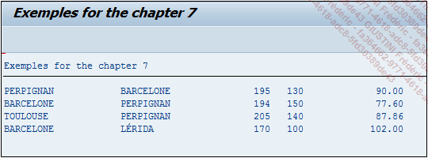

# **`FONCTION DE CONVERSION`**

```JS
cast( col AS fltp )
```

Elle convertit un champ en nombre à virgule flottante (type `FLTP`).

_Exemple_

_Calcul de la vitesse moyenne du véhicule pendant un trajet._

```JS
CONSTANTS: c_60(2) TYPE i VALUE '60'.

SELECT city_from,
       city_to,
       kms,
       duration,
       CAST( kms AS FLTP ) * CAST( @c_60 AS FLTP )
/ CAST( duration AS FLTP ) AS vitesse
  FROM ztravel
  INTO TABLE @DATA(t_cast).


DATA: s_cast LIKE LINE OF t_cast.

LOOP AT t_cast INTO s_cast.
  WRITE:/ s_cast-city_from, s_cast-city_to, s_cast-kms,
          s_cast-duration,  s_cast-vitesse.
ENDLOOP.
```

La constante de type entier d’une longueur de 2 positions a été créée contenant la valeur fixe `60`. La sélection va importer les champs `CITY_FROM`, `CITY_TO`, `KMS` et `DURATION` pour ensuite calculer la vitesse du véhicule en convertissant en nombre à virgule flottante, les champs `KMS`, `DURATION` et la variable `C_60` avec le `CAST` dont le résultat sera stocké dans la colonne `VITESSE`.

Une fois de plus, grâce à l’`instruction @DATA`, la table interne sera créée automatiquement et contiendra les valeurs suivantes, qui seront ensuite affichées à l’écran après avoir déclaré une structure :

| **CITY_FROM** | **CITY_TO** | **KMS** | **DURATION** | **VITESSE**            |
| ------------- | ----------- | ------- | ------------ | ---------------------- |
| PERPIGNAN     | BARCELONE   | 195     | 130          | 9.0000000000000000E+01 |
| BARCELONE     | PERPIGNAN   | 194     | 150          | 7.7600000000000009E+01 |
| TOULOUSE      | PERPIGNAN   | 205     | 140          | 8.7857142857142847E+01 |
| BARCELONE     | LERIDA      | 170     | 100          | 1.0200000000000000E+02 |

Le résultat sera de type `FLTP` également et devra être retravaillé par la suite pour une meilleure visibilité de la valeur comme par exemple, en la stockant dans une variable à virgule à deux décimales et en l’affichant ensuite dans le `LOOP`.

```JS
DATA:      v_vit   TYPE p DECIMALS 2.
CONSTANTS: c_60(2) TYPE i VALUE '60'.


SELECT city_from,
       city_to,
       kms,
       duration,
       CAST( kms AS FLTP ) * CAST( @c_60 AS FLTP ) /
CAST( duration AS FLTP ) AS vitesse
  FROM ztravel
  INTO TABLE @DATA(t_cast).


DATA: s_cast LIKE LINE OF t_cast.

LOOP AT t_cast INTO s_cast.
  CLEAR v_vit.                "Nettoyage de la variable
  v_vit = s_cast-vitesse.     "Transférer la valeur de VITESSE
                              "dans la variable V_VIT

  WRITE:/ s_cast-city_from, s_cast-city_to, s_cast-kms,
          s_cast-duration,  v_vit.

ENDLOOP.
```

_Résultat à l'écran_


