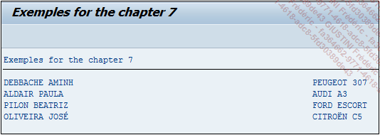

# **`FONCTION DE CONCATENATION`**

```JS
obj1 && obj2 [&& obj3 ... ]
```

Comme l'instruction [`CONCATENATE`](../../01_Variables/04_concatenate.md), cette fonction concatène deux ou plusieurs objets. Ces objets peuvent être une colonne d'une table, une variable...

_Exemple_

Dans la table des conducteurs `ZDRIVER_CAR`, afficher deux colonnes :

- La 1ère contenant le nom et le prénom du conducteur
- La 2e contenant la marque et le modèle de la voiture

```JS
SELECT surname   && @space && name      AS driver,
       car_brand && @space && car_model AS car
  FROM zdriver_car
  INTO TABLE @DATA(t_drivers).

DATA s_drivers LIKE LINE OF t_drivers.

LOOP AT t_drivers INTO s_drivers.
  WRITE:/ s_drivers-driver, s_drivers-car.
ENDLOOP.
```

_Résultat de la requête_

| **DRIVER**     | **CAR**     |
| -------------- | ----------- |
| DEBBACHE AMINH | PEUGEOT 307 |
| ALDAIR PAULA   | AUDI A3     |
| PILON BEATRIZ  | FORD ESCORT |
| OLIVEIRA JOSE  | CITROEN C5  |

_Résultat à l'écran_


