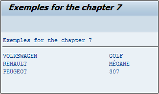

# **`UP TO N ROWS`**

```JS
. . .UP TO n ROWS. . .
```

Restreint la sélection à `n lignes` où `n` est un nombre positif.

_Exemple_

\_Sélectionner les trois dernières lignes de la table `ZCAR_BRAND_MOD`.

```JS
SELECT brand,
       model
  FROM zcar_brand_mod
  UP TO 3 ROWS
  INTO TABLE @DATA(t_car)
  ORDER BY brand DESCENDING.


DATA s_car LIKE LINE OF t_car.

LOOP AT t_car INTO s_car.
  WRITE:/ s_car-brand, s_car-model.
ENDLOOP.
```

_Résultat de la requête_

| **BRAND**  | **MODEL** |
| ---------- | --------- |
| VOLKSWAGEN | GOLF      |
| RENAULT    | MEGANE    |
| PEUGEOT    | 307       |

_Résultat à l'écran_



> Il est important de respecter la séquence de saisie des différentes clauses et fonctions de la requête, au risque d'avoir une erreur de syntaxe lors du contrôle de cette dernière, et peut-être de perdre du temps à se demander pourquoi le programme ne peut pas s'activer :

1. SELECT ...

2. Pour les clauses/fonctions suivantes, pas d’ordre précis
   FROM + ON (si utilisation du JOIN)
   INTO
   UP TO n ROWS

3. WHERE

4. GROUP BY

5. HAVING

6. ORDER BY
