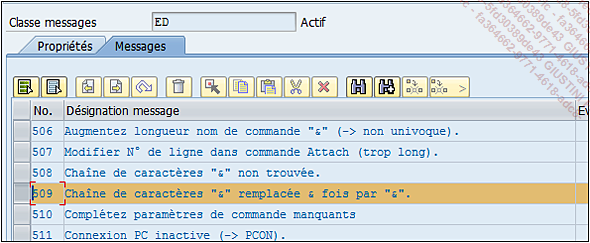
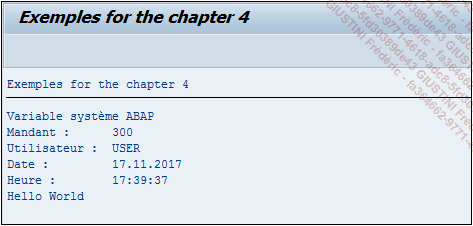

# **SY-SYSTEM**

## **LISTE SY-SYSTEM**

| CODE       | DESCRIPTION                                                                                                                        |
| ---------- | ---------------------------------------------------------------------------------------------------------------------------------- |
| `sy-batch` | est-on en mode batch                                                                                                               |
| `sy-cdate` | contient la date du système de compilation du programme                                                                            |
| `sy-cprog` | contient le nom du programme principal                                                                                             |
| `sy-cputm` | contient l'heure de compilation du programme                                                                                       |
| `sy-datum` | contient la date du système en format AAAAMMJJ                                                                                     |
| `sy-dbcnt` | contient le nombre de connexions de base de données actives dans l'instance SAP (retourne le nombre de ligne insérées pour INSERT) |
| `sy-dynnr` | contient le numéro dynamique de l'écran actuel (utile pour les programmes de type "dynpro")                                        |
| `sy-fdpos` | contient la position de la valeur du FIND dans la chaine de source                                                                 |
| `sy-host`  | contient le nom de l'hôte de l'application                                                                                         |
| `sy-index` | contient l'index actuel de la boucle DO / WHILE                                                                                    |
| `sy-langu` | contient la langue système active                                                                                                  |
| `sy-lisel` | contient le nombre d'entrées sélectionnées par la dernière instruction SELECT                                                      |
| `sy-mandt` | contient le mandant de connexion                                                                                                   |
| `sy-msgno` | contient le numéro de message de la dernière instruction ABAP                                                                      |
| `sy-msgty` | contient le type de message de la dernière instruction ABAP                                                                        |
| `sy-msgv1` | contiennent les variables pour les valeurs de messages associées à la dernière instruction ABAP                                    |
| `sy-opsys` | système d’exploitation (UNIX par exemple)                                                                                          |
| `sy-pagno` | n° de page courant                                                                                                                 |
| `sy-repid` | contient le nom du programme actif                                                                                                 |
| `sy-subrc` | contient le code de retour de la dernière instruction ABAP                                                                         |
| `sy-sysid` | contient l'ID système de l'instance SAP                                                                                            |
| `sy-tabix` | contient l'index actuel de la ligne de la table interne active                                                                     |
| `sy-tcode` | contient le code transaction de la transaction en cours d'exécution                                                                |
| `sy-uname` | contient le nom de l'utilisateur actuel                                                                                            |
| `sy-user`  | contient le nom de l'utilisateur                                                                                                   |
| `sy-uzeit` | contient l'heure système en format HHMMSS                                                                                          |

### **SY_MSGTY**

> Le statut de message `SY-MSGTY` sera toujours accompagné d’une classe de message `SY-MSGID`, et de son numéro `SY-MSGNO`, avec les paramètres `SY-MSGV1`, `SY-MSGV2`, `SY-MSGV3`, et `SY-MSGV4` consultables via la transaction `SE91`.
>
> 
>
> Ce message comporte trois paramètres symbolisés par le caractère `&`. Ainsi la valeur du premier paramètre sera stockée dans la variable système `SY-MSGV1`, le deuxième dans `SY-MSGV2`, et le troisième dans `SY-MSGV3` (le quatrième sera vide car non utilisé). Aussi, si les valeurs sont définies de la façon suivante :
>
> - `SY-MSGTY` = `I`
> - `SY-MSGID` = `ED`
> - `SY-MSGNO` = `509`
> - `SY-MSGV1` = `Hello`
> - `SY-MSGV2` = `3`
> - `SY-MSGV3` = `Bye`
>
> SAP aura toutes les informations pour construire un message d’information `I` comportant le texte : Chaîne de caractères `Hello` remplacée 3 fois par `Bye`.
>
> Pour illustrer ce point un petit programme pour afficher quelques informations du système et une constante contenant la valeur `Hello world`.
>
> ```JS
> CONSTANTS : c_text(11)  TYPE c VALUE 'Hello World'.
>
> WRITE:/ 'Variable système ABAP'.
> WRITE:/ 'Mandant :     ', sy-mandt.
> WRITE:/ 'Utilisateur : ', sy-uname.
> WRITE:/ 'Date :        ', sy-datum.
> WRITE:/ 'Heure :       ', sy-uzeit.
> WRITE / c_text.
> ```
>
> 
