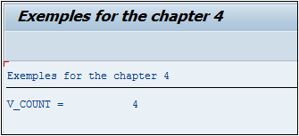
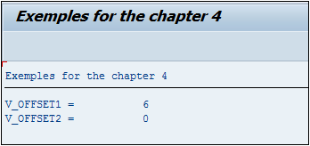
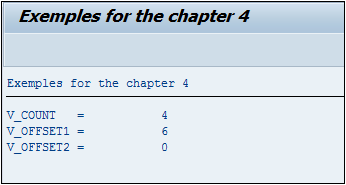
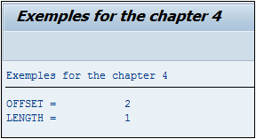

# **`FIND`**

```JS
FIND [ {FIRST OCCURRENCE} | {ALL OCCURRENCES} OF ] pattern
     IN [section_of] dobj
     [IN {BYTE|CHARACTER} MODE]
     [ {RESPECTING | IGNORING} CASE]
     [MATCH COUNT mcnt]
     { { [MATCH OFFSET moff] [MATCH LENGTH mlen] } | [RESULTS result_tab|result_wa] }.
```

> L’instruction `FIND` recherche une chaîne de caractères modèle `pattern` dans une chaîne de caractères source `IN` `dobj`. Deux options sont possibles :
>
> - soit chercher toutes les occurrences `ALL OCCURRENCES` et stocker le résultat dans une table interne `result_tab`
> - soit uniquement la première `FIRST OCCURRENCE` et stocker le résultat dans une structure `result_wa`.

> Si l’option du résultat n’est pas indiquée (dans le cas du `FIRST OCCURRENCE`), la variable système [`SY-FDPOS`](../99_Help/02_SY-SYSTEM.md) est renseignée, contenant la position dans la chaîne source où a été trouvé le modèle.

> Paramètre(s) supplémentaire(s) optionnel(s) :
>
> - `IN BYTE MODE` ou `IN CHARACTER MODE`, est un paramètre qui revient assez souvent en `ABAP`. La valeur par défaut sera toujours `IN CHARACTER MODE`. `IN BYTE MODE` est le plus souvent utilisé lors d’un travail avec des variables de type hexadécimal, autant dire assez rarement.
>
> - `RESPECTING`/`IGNORING CASE` indique si la casse de la chaîne de caractères doit être respectée. Par défaut, si cette option n’est pas renseignée, `RESPECTING CASE` est automatiquement choisie.
>
> - `MATCH COUNT` compte le nombre d’occurrences trouvées et sera toujours égal à 1 si l’option `FIRST OCCURRENCE` est choisie.

```JS
DATA: v_count TYPE I,
      v_text  TYPE string.

v_text = 'ABADAFAX'.
FIND ALL OCCURRENCES OF 'A' IN v_text MATCH COUNT v_count.

WRITE: 'V_COUNT = ', v_count.
```

> La variable V_COUNT contiendra la valeur 4.



> - `MATCH OFFSET` indique la dernière position du caractère modèle trouvée dans la chaîne source dans le cas du `ALL OCCURRENCES`, sinon ce sera la première position. La position des caractères commence à `0`.

```JS
DATA: v_offset1 TYPE i,
      v_offset2 TYPE i,

      v_text    TYPE string.

v_text = 'ABADAFAX'.

FIND ALL OCCURRENCES OF 'A'  IN v_text MATCH OFFSET v_offset1.
FIND FIRST OCCURRENCE OF 'A' IN v_text MATCH OFFSET v_offset2.

WRITE:  'V_OFFSET1 = ', v_offset1,
      / 'V_OFFSET2 = ', v_offset2.
```

> Dans une chaîne de caractères, la première position est `0`, ainsi dans cet exemple, le premier `A` se trouve à la position `0`, soit tout au début, et le dernier à la position `6`. Les variables `V_OFFSET1` et `V_OFFSET2` contiendront respectivement les valeurs `6` et `0`.



> - `MATCH LENGTH` retourne la longueur de la chaîne de caractères modèle. Utiliser le dernier exemple n’est pas très significatif car la longueur de `A` est de 1 mais s’il s’agit d’un cas complexe avec des variables dont les valeurs ne sont pas connues et attribuées dynamiquement, cette option serait utile.
>
> - `RESULTS` est soit une structure contenant le résultat du `REPLACE` `FIRST OCCURRENCE` soit une table `ALL OCCURRENCES` Elle est aussi de la forme `MATCH_RESULT` contenant les champs `OFFSET` et `LENGTH`

> Petit aparté concernant les résultats : comme pour le `SPLIT`, il est possible de déclarer les variables dans l’instruction. Ainsi les exemples ci-dessus seront de la forme :

```JS
DATA: v_text TYPE string.

v_text = 'ABADAFAX'.


FIND ALL OCCURRENCES  OF 'A' IN v_text
     MATCH COUNT DATA(v_count).

FIND ALL OCCURRENCES  OF 'A' IN v_text
     MATCH OFFSET DATA(v_offset1).

FIND FIRST OCCURRENCE OF 'A' IN v_text
     MATCH OFFSET DATA(v_offset2).

WRITE: /'V_COUNT   = ', v_count,
       /'V_OFFSET1 = ', v_offset1,
       /'V_OFFSET2 = ', v_offset2.
```

> Les variables `V_COUNT`, `V_OFFSET1`, et `V_OFFSET2` seront créées comme un nombre de type entier.



> - `IN section... of...` permet de restreindre la chaîne de caractères cible `dobj` à une partie définie par l’option `OFFSET` (position de départ) et/ou `LENGTH` (longueur de la chaîne cible à partir de la gauche).

```JS
DATA v_text TYPE string.

v_text = 'ABADAFAX'.
FIND FIRST OCCURRENCE OF 'A'
     IN SECTION OFFSET 2 LENGTH 4 OF v_text
     RESULTS DATA(s_results).

WRITE: /'OFFSET = ', s_results-offset,
       /'LENGTH = ', s_results-length.
```

> Va chercher la première occurrence de la lettre `A` dans la chaîne de caractères cible `ABADAFAX` restreinte à partir de la deuxième position et d’une longueur de quatre positions, soit `ADAF`.


