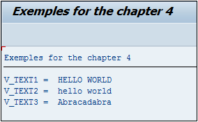

# **`TRANSLATE`**

```JS
TRANSLATE text {TO {UPPER | LOWER} CASE} | {USING mask}.
```

> La commande `TRANSLATE` permet de convertir la casse d’une chaîne de caractères (tout en majuscules `UPPER CASE` ou tout en minuscules `LOWER CASE`) ou bien de convertir la chaîne selon un schéma défini dans un masque.

```js
DATA: v_text1 TYPE string,
      v_text2 TYPE string,
      v_text3 TYPE string.

v_text1 = v_text2 = 'Hello World'.
v_text3 = 'Barbcbdbarb'.

TRANSLATE v_text1 TO UPPER CASE.
TRANSLATE v_text2 TO LOWER CASE.

TRANSLATE v_text3 USING 'ABBAabba'.

WRITE: /'V_TEXT1 = ', v_text1,
       /'V_TEXT2 = ', v_text2,
       /'V_TEXT3 = ', v_text3.
```

> Trois variables ont été définies, toutes de type string : les deux premières contiennent le texte `Hello World` alors que la troisième est égale à `Barbcbdbarb`.
>
> Le premier translate va modifier `V_TEXT1` et aura comme valeur `HELLO WORLD`.
>
> Le deuxième translate va modifier `V_TEXT2` qui aura comme valeur `hello world`.
>
> Le troisième translate va utiliser le masque `ABBAabba` sur la variable `V_TEXT3`. Le masque a la logique suivante (il est nécessaire pour comprendre de prendre par paquet de deux lettres) :
>
> - Lorsque la lettre `A` est rencontrée, la changer pour `B`.
>
> - Lorsque la lettre `B` est rencontrée, la changer pour `A`.
>
> - Lorsque la lettre `a` est rencontrée, la changer pour `b`.
>
> - Lorsque la lettre `b` est rencontrée, la changer pour `a`.
>
> Ainsi, suivant cette logique, le texte `V_TEXT3` aura comme valeur finale `Abracadabra`.


