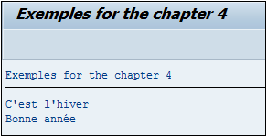

# **`IF CO - CONTAINS ONLY`**

> ```JS
> IF oper1 CO oper2.
>   ...
> ENDIF.
> ```
>
> `CO` signifie en anglais `Contains Only` et vérifie que la chaîne de caractères > `oper1` contient seulement celle contenue dans oper2.
>
> ```JS
> DATA: c_oper1 TYPE char5 VALUE 'Hello',
>       c_oper2 TYPE char5 VALUE 'Hello'.
> IF c_oper1 CO c_oper2.
>   WRITE:/ 'C_OPER1 contient la chaîne de caractères ', c_oper2, ' à la position ', sy-fdpos.
> ELSE.
>   WRITE:/ 'C_OPER1 ne contient pas la chaîne de caractères ', c_oper2.
> ENDIF.
> ```
>
> Deux constantes `C_OPER1` et `C_OPER2` ont été créées contenant la valeur `Hello`. Une condition va ensuite vérifier que `C_OPER1` contient seulement la chaîne de caractères contenue dans `C_OPER2`. Dans ce cas, un message sera retourné indiquant la position du dernier caractère de `C_OPER2` trouvée dans `C_OPER1`, à savoir `5`, et stocké dans la variable système [sy_fdpos](../99_Help/02_SY-SYSTEM.md). Si la chaîne de caractères de `C_OPER2` est légèrement différente (égale à `Hell` par exemple) alors la condition n’est pas remplie et le programme retournera le message contenu dans le `ELSE`.
>
> 
