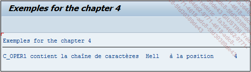

# **`CA - CONTAINS NOT ONLY`**

> ```JS
> IF oper1 CN oper2.
>   ...
> ENDIF.
> ```
>
> `CN` signifie en anglais `Contains Not only` et au contraire de `CO`, vérifie que la chaîne de caractères `oper1` n’est pas uniquement composée de celle contenue dans `oper2`.
>
> ```JS
> DATA: c_oper1 TYPE char5 VALUE 'Hello',
>       c_oper2 TYPE char4 VALUE 'Hell'.
>
> IF c_oper1 CN c_oper2.
>   WRITE:/ 'C_OPER1 contient la chaîne de caractères ', c_oper2, '
> à la position ', sy-fdpos.
> ELSE.
>   WRITE:/ 'C_OPER1 ne contient pas la chaîne de caractères ', c_oper2.
> ENDIF.
> ```
>
> L’exemple précédent est repris en modifiant la valeur de la constante `C_OPER2` pour `Hell`. Dans ce cas, avec l’opérateur `CN`, le programme trouve la chaîne de caractères recherchée et renvoie sa position dans la variable système [sy_fdpos](../99_Help/02_SY-SYSTEM.md) de la même manière que pour le `CO`, à savoir la dernière position trouvée dans la constante `C_OPER1`, ici égale à `4`.
>
> 
