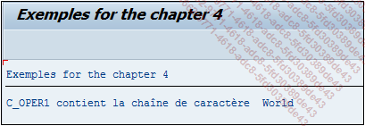

# **`CS - CONTAINS STRING`**

> ```JS
> IF oper1 CS oper2.
>   ...
> ENDIF.
> ```
>
> `CS` signifie en anglais `Contains String` et recherchera dans la chaîne de caractères `oper1`, celle de `oper2`.
>
> ```JS
> DATA: c_oper1 TYPE char11 VALUE 'Hello World',
>       c_oper2 TYPE char5  VALUE 'World'.
>
> IF c_oper1 CS c_oper2.
>   WRITE:/ 'C_OPER1 contient la chaîne de caractères ', c_oper2.
> ELSE.
>   WRITE:/ 'C_OPER1 ne contient pas la chaîne de caractères ', c_oper2.
> ENDIF.
> ```
>
> Ici, la constante `C_OPER1` contient la chaîne de caractères `Hello World` et `C_OPER2`, `World`. La condition vérifiera que `C_OPER1` contient la chaîne de caractères contenue dans `C_OPER2` et en retournera le message correspondant.
>
> 
>
> Il est possible et plus facile d’utiliser la commande FIND vue précédemment, au lieu de la condition CS.
