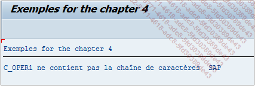

# **`NS - NO STRING`**

> ```JS
> IF oper1 NS oper2.
>   ...
> ENDIF.
> ```
>
> `NS` signifie en anglais contains `No String` et vérifiera que la chaîne de caractères oper1 ne soit pas contenue dans celle de oper2.
>
> ```JS
> DATA: c_oper1 TYPE char11 VALUE 'Hello World',
>       c_oper2 TYPE char3  VALUE 'SAP'.
>
> IF c_oper1 NS c_oper2.
>   WRITE:/ 'C_OPER1 ne contient pas la chaîne de caractères ', c_oper2.
> ELSE.
>   WRITE:/ 'C_OPER1 contient la chaîne de caractères ', c_oper2.
> ENDIF.
> ```
>
> Ici, la constante `C_OPER1` contient la chaîne de caractères `Hello World` et `C_OPER2`, `SAP`. La condition vérifiera que `C_OPER1` ne contient pas la chaîne de caractères contenue dans `C_OPER2` et en retournera le message correspondant.
>
> 
