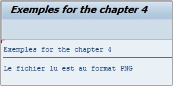

# **`CP - COVERS PATTERN`**

```JS
IF oper1 CP oper2.
  ...
ENDIF.
```

> `CP` signifie en anglais `Covers Pattern` et vérifiera que la chaîne de caractères `oper1` respecte un modèle contenu dans `oper2`.

```JS
DATA: c_oper1 TYPE char9 VALUE 'image.png',
      c_oper2 TYPE char5 VALUE '*.png'.

IF c_oper1 CP c_oper2.
  WRITE:/ 'Le fichier lu est au format PNG'.
ELSE.
  WRITE:/ 'Le fichier lu n''est pas au format PNG'.
ENDIF.
```

> La constante `C_OPER1` contient la chaîne de caractères `image.png` et en utilisant la condition `CP`, le programme va vérifier que celle-ci est composée du modèle contenu dans `C_OPER2` à savoir `*.png`.


