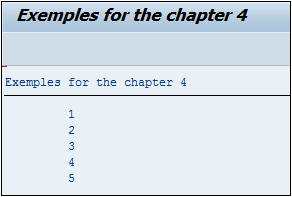

# **`DO ENDDO`**

```JS
DO [n TIMES].
  [statement_block]
ENDDO.
```

> Une `boucle` en programmation est un processus permettant de répéter une opération autant de fois que nécessaire. En `ABAP` il en existe trois au total (une sera développée dans le chapitre Les tables internes - Organisation et Lecture) dont la première est le `DO… ENDDO`.
>
> L’option `n TIMES` permet de définir combien de fois la boucle doit être répétée.

```JS
DO 5 TIMES.
  WRITE:/ sy-index.
ENDDO.
```

> La variable système [SY-INDEX](../99_Help/02_SY-SYSTEM.md) est un compteur et indique donc combien de fois la boucle a été exécutée. Ainsi le `DO` a été paramétré pour être exécuté cinq fois et à chaque fois, la variable [SY-INDEX](../99_Help/02_SY-SYSTEM.md) est affichée. Le résultat final sera le suivant :



> Il est très important de toujours définir une sortie à une boucle au risque de créer une `boucle infinie`. Dans cet exemple l’option `n TIMES` a été utilisée, mais il est également possible d’utiliser des instructions comme `EXIT`.
