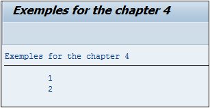
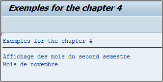

# **`CHECK`**

> Le `CHECK` est une condition comparant l’état d’une variable avec une autre. Si la condition est vraie alors le programme continue sinon il sort du traitement :

```JS
DO 5 TIMES.
  CHECK sy-index < 3.
  WRITE / sy-index.
ENDDO.
```

> La boucle est initialisée pour être exécutée cinq fois. Un `CHECK` vérifiera si la variable système [SY-INDEX](../99_Help/02_SY-SYSTEM.md) est strictement inférieure à `3`, si oui alors elle sera affichée, sinon le programme passera à la ligne suivante.



> Dans le résultat, les valeurs 1 et 2 sont affichées et comme le reste (3, 4 et 5) n’a pas été validé par le `CHECK`, alors il a été mis de côté.
>
> Le `CHECK` peut très bien être comparé au `IF... ENDIF` et peut tout aussi bien être utilisé tel quel, hors d’une boucle :

```JS
DATA: v_month TYPE i.

v_month = sy-datum+4(2).

CHECK v_month GE 6.

WRITE:/ 'Affichage des mois du second semestre'.

CASE v_month.
  WHEN 6.
    WRITE:/'Mois de juin'.
  WHEN 7.
    WRITE:/'Mois de juillet'.
  WHEN 8.
    WRITE:/'Mois d''août'.
  WHEN 9.
    WRITE:/'Mois de septembre'.
  WHEN 10.
    WRITE:/'Mois d''octobre'.
  WHEN 11.
    WRITE:/'Mois de novembre'.
  WHEN 12.
    WRITE:/'Mois de décembre'.
ENDCASE.
```

> Le programme va tout d’abord commencer par vérifier que le mois en cours est supérieur ou égal à 6, puis avec un CASE, il affichera le mois en cours.


