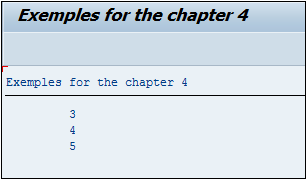

# **`CONTINUE`**

> Le `CONTINUE` a un fonctionnement bien différent. Il est souvent utilisé dans une condition `IF` et si celle-ci est validée, alors le `CONTINUE` arrêtera le traitement pour passer à la ligne suivante.

```JS
DO 5 TIMES.
  IF sy-index < 3.
    CONTINUE.
  ENDIF.
  WRITE / sy-index.
ENDDO.
```

> La boucle `DO` est configurée pour être exécutée cinq fois. Une condition va tester si la valeur de la variable système [SY-INDEX](../99_Help/02_SY-SYSTEM.md) est strictement inférieure à `3`. Si oui, alors le traitement de la ligne est arrêté pour passer à la suivante (`CONTINUE`) sinon il affichera [SY-INDEX](../99_Help/02_SY-SYSTEM.md).



> Les valeurs `1` et `2` étant strictement inférieures à `3`, ne seront pas affichées par le `WRITE` alors que le reste le sera.
