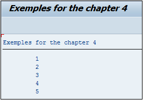

# **`WHILE ENDWHILE`**

> ```JS
> WHILE log_exp.
>   [statement_block]
> ENDWHILE.
> ```
>
> Le `WHILE` a le même comportement que le `DO` sauf que le paramètre de sortie est cette fois obligatoire (`WHILE log_exp`).
>
> En reprenant le même exemple que le `DO`, à savoir, boucler cinq fois et afficher la variable système [SY-INDEX](../99_Help/02_SY-SYSTEM.md), le programme ressemblera à ceci :
>
> ```JS
> WHILE sy-index <= 5.
>   WRITE:/ sy-index.
> ENDWHILE.
> ```
>
> `WHILE` pouvant être traduit par `tant que`, ce code peut être littéralement traduit par « tant que la variable système [SY-INDEX](../99_Help/02_SY-SYSTEM.md) est inférieure ou égal à `5`, afficher sa valeur ». Le résultat à l’écran sera le même que pour le `DO`.
>
> 
>
> Les options utilisées avec le `DO` peuvent très bien servir pour le `WHILE`, à savoir `CHECK`, `CONTINUE` et `EXIT` (pouvant être utilisé dans des cas particuliers même si la condition de sortie de boucle du WHILE est prédéfinie).
