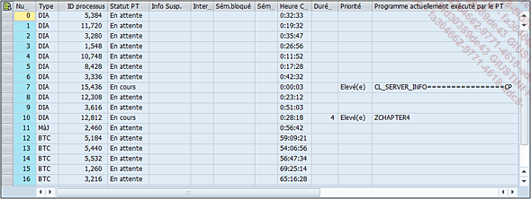
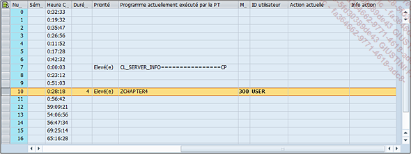
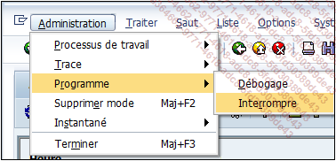
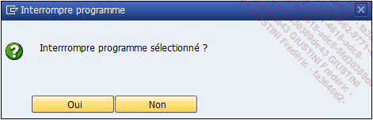

# **`BOUCLE INFINIE`**

> Dans la partie sur la boucle `DO... ENDDO`, il a été mentionné le risque de créer une `boucle infinie` si une condition de sortie n’était pas définie. Seulement, il est possible de faire des erreurs et d’en créer une par mégarde. Cette section propose une astuce pour pallier cette situation si elle se produit.

```JS
DO.
  WRITE:/ sy-index.
ENDDO.
```

> Ce code va tourner en boucle en permanence, affichant la variable [SY-INDEX](../99_Help/02_SY-SYSTEM.md) à l’infini, du moins en théorie, car après un temps d’exécution dépassant 10 minutes (en règle générale, car cette valeur est paramétrée par l’équipe `Basis` et diffère selon les clients et les projets), le programme s’arrête avec un dump de type `TIMEOUT`.
>
> Lorsque ce programme est exécuté, il sera totalement bloqué et impossible de l’arrêter directement. Il faudra alors exécuter les actions suivantes :
>
> 1 - Exécuter la transaction `SM50` dans une nouvelle session : `/oSM50`.
>
> 
>
> 2 - La liste de tous les processus en cours apparaît. Une fois que le programme en cause est repéré (nom de `colonne Progr.`) et qu’il est bien associé au nom d’utilisateur de connexion (`Nom d’util.`), cliquer sur le nom du programme puis dans la liste déroulante, choisir l’option Interrompre :
>
> Administration - Programme - Interrompre
>
> 
>
> 
>
> 3 - Au message d’alerte demandant si cette action doit être poursuivie, répondez par `Oui`.
>
> 
>
> En rafraîchissant l’écran (touche clavier `[F8]` ou le bouton avec les deux Flèches bleues en dessous du titre), la ligne du programme a disparu, et la fenêtre où était exécuté le programme est retournée à l’écran d’accueil.
>
> 
