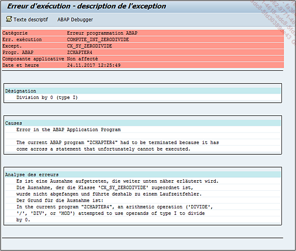
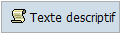
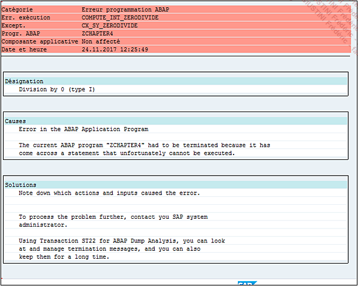
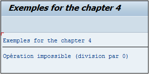

# **`DUMP`**

> 
>
> Quelques précisions sur l’écran du dump et pour ceci, il serait intéressant de cliquer sur le bouton `Texte descriptif` afin d’avoir tout le détail.
>
> 
>
> Le nouvel écran est quasiment identique au précédent et est divisé en plusieurs parties :
>
> 
>
> - `En-tête` avec la catégorie du dump (erreur ABAP, de mémoire système, de base de données...), un code système d’erreur (COMPUTE_INT_ZERODIVIDE dans ce cas), la classe d’exception rencontrée par le noyau SAP pendant l’exécution du programme (CX_SY_ZERODIVIDE), le nom du programme ayant causé ce dump, la date et l’heure.
> - `Désignation` : affiche un bref descriptif de l’erreur.
> - `Causes` : pourquoi SAP retourne cette erreur.
> - `Solutions` : indique très succinctement les personnes à prévenir (ici le développeur).
> - `Analyse des erreurs` : décrit l’erreur rencontrée par SAP avec un peu plus de précisions système.
> - `Comment corriger l’erreur` (pour les personnes citées dans la partie Solutions) : indique ici que faire, par exemple, nous inviter à vérifier si SAP n’a pas un correctif s’il s’agit d’un programme standard (correctif appelé note OSS), ou bien, toujours dans le cas d’un programme standard, comment faire pour signaler cette erreur à SAP et quelles informations doivent être mises en avant...
> - `Environnement système` est une liste technique regroupant tout le détail du système SAP : nom du serveur, nom de la base de données, adresse IP, numéro d’installation SAP, nom du système de connexion...
> - `Utilis. et transaction` regroupe les informations relatives au programme SAP : son nom, la transaction appelée, le numéro d’écran...
> - `Infos sur point d’interruption` : donne une précision sur l’endroit du programme, et l’événement lors duquel cela s’est produit.
> - `Extrait code source` : affiche les lignes du programme avec l’indication ’>>>>>’ sur la ligne avec erreur.
> - `Contenu zones systèmes` : affiche la table SY.
> - `Appels/Événements actifs` : liste tous les programmes avant que le dump surgisse. Dans ce cas, c’est assez simple, mais parfois pour des transactions complexes (MIGO, VA01...) plusieurs programmes standards sont appelés et cette liste aide bien à savoir où localiser le problème et à quel niveau.
> - `Variables sélectionnées` sont des variables systèmes actives avant le dump.
> - `Remarq. Internes` : situe à quel niveau du noyau SAP (SAP kernel) l’erreur s’est produite.
> - `Appels actifs dans noyau SAP` : liste l’activité du noyau SAP.
> - `Liste des programmes ABAP impliqués` est un journal avec date et heure de chaque programme exécuté avant le dump.
> - `Répertoire des tables applicatives` : répertorie pour chaque programme, les tables utilisées et/ou mises à jour. Dans cet exemple, il s’agit uniquement des tables SY et SYST regroupant les mêmes informations système.
> - `Blocs contrôle ABAP (CONT)` : relève toutes les informations relatives aux blocs de contrôle (processus, état, espace d’adressage...).
>   Tout en haut de l’écran se trouvent trois boutons.
> - `Saut - Synthèse [F6]` - Synthèse affiche un volet de navigation regroupant les parties citées précédemment.
> - `Saut - ABAP Debugger [F7]` - ABAP Debugger ouvre le programme sur la ligne avec erreur en mode débogage.
>   `Err. exécution - Affichage non mis en forme [F9]` - Affichage non mis en forme offre une vision un peu brute du dump.
>
> Les dumps peuvent être consultés via la transaction `ST22`.
>
> Le programme ayant été développé, s’il retourne un dump, il doit être rapidement corrigé. Pour cela, la condition `IF` sera utilisée afin de vérifier que la variable `V_B` est strictement supérieure à `0`.
>
> ```JS
> DATA: v_a      TYPE i,
>       v_b      TYPE i,
>       v_result TYPE i.
>
> v_a = 5.
> v_b = 0.
>
> IF v_b GT 0.
>   v_result = v_a / v_b.
>   WRITE v_result.
> ELSE.
>   WRITE 'Opération impossible (division par 0)'.
> ENDIF.
> ```
>
> Une nouvelle fois, le programme est sauvegardé, contrôlé, activé puis exécuté. Cette fois-ci, pas de dump, le programme affiche bien le texte `Opération impossible (division par 0)`.
>
> 
