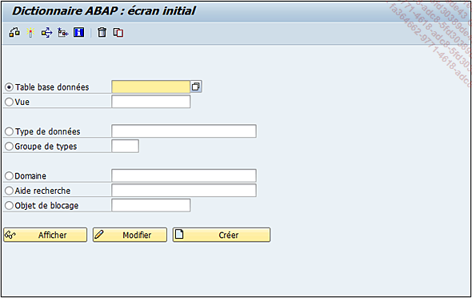

# **`SE11`**

> 

## **FEATURES**

> - `Table base de données` : la table classique de la programmation où sont stockées toutes les informations du système (table des clients, fournisseurs...) .
>
> - `Vue` : regroupement de plusieurs tables permettant d’accéder rapidement et simultanément à un large éventail d’informations .
>
> - `Type de données` qui peut être un élément de données, une structure ou un type de table. Ces éléments seront développés dans la suite de ce chapitre.
>
> - `Groupe de Types` : une sorte d’include où sont stockées plusieurs types de variables (constantes, type de table...).
>
> - `Domaine` (cf. section dans ce chapitre sur les domaines) .
>
> - `Aide recherche` (cf. section dans ce chapitre sur l’aide à la recherche) .
>
> - `Objet de blocage` : permet le blocage d’une table si besoin. La création d’un objet de blocage va créer automatiquement deux modules fonction :
>
>   - `ENQUEUE_nom-objet-blocage` (appel de cette fonction pour bloquer la table)
>
>   - `DEQUEUE_nom-objet-blocage` (appel de cette fonction pour débloquer la table)

## **MENU**

> - `Contrôler l’objet` - Contrôler `[Ctrl][F2]` : Objet du Dictionnaire ABAP - Contrôler
>
> - `Activer` - Activer `[Ctrl][F3]` : Objet du Dictionnaire ABAP
>
> - `Cas d’Emploi` - Utilitaires(M) - Cas d’Emploi `[Ctrl][Shift][F3]` : qui, comme pour un programme, permet de savoir où est utilisé l’objet du DDIC (dans des programmes, fonctions, classes, autres objets du dictionnaire de données...).
>
> - `Analyser l’environnement` - Utilitaires(M) - Analyser l’environnement `[Ctrl][Shift][F4]` : liste tous les composants ABAP que l’objet DDIC utilise dans sa définition. Exemple pour une table, il va lister tous les éléments de données de la clé, les aides à la recherche, les références des tables externes...
>
> - `Aide à l’application` - Saut - Aide à l’application `[Ctrl][F8]` : Aide - Aide à l’application
>
> - `Supprimer un objet du DDIC` - Objet du Dictionnaire ABAP - Supprimer `[Shift][F2]`
>
> - `Copier un objet du DDIC` - Objet du Dictionnaire ABAP - Copier... `[Ctrl][F5]`
>
> - `Objet du Dictionnaire ABAP` - Afficher(Z) `[F7]`
>
> - `Objet du Dictionnaire ABAP` - Modifier `[F6]`
>
> - `Objet du Dictionnaire ABAP` - Créer `[F5]`
