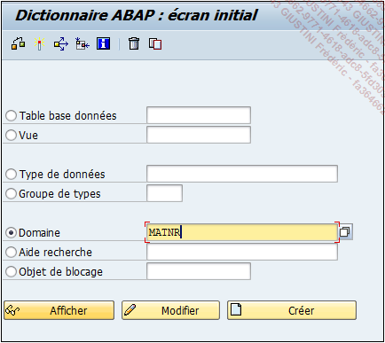
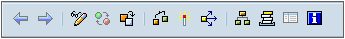

# **`DOMAINES`**

> Un `domaine` va définir les `caractéristiques techniques de base` d’un champ contenu dans une table. Il peut être de plusieurs types dont voici les principaux :
>
> - `CHAR` : chaîne de caractères alphanumériques (et donc contenant aussi bien des chiffres que des lettres), mais toujours considérée comme un texte.
> - `CURR` : pour l’anglais Currency, devise d’un montant (euro, dollar...).
> - `DATS` : format date.
> - `DEC` : décimal pouvant contenir bien sûr une décimale mais aussi un signe (+ ou -), et un séparateur de milliers. Sa longueur maximale est de 31 positions.
> - `FLTP` : nombre flottant incluant aussi une décimale, mais dont la longueur maximale ne peut être supérieure à 16 positions.
> - `INT1`, `INT2` et `INT4` : utilisés pour les nombres entiers.
> - `NUMC` : texte numérique, ou plus précisément un nombre qui sera considéré à la fois comme une valeur numérique et un texte (utile lors d’une concaténation d’un texte et d’un chiffre incrémenté dans une boucle cf. chapitre Instructions basiques ABAP - Opérations sur variable texte) .
> - `STRING` : chaîne de caractères ayant une longueur importante (utilisé pour une description, par exemple).
>
> Il existe beaucoup plus de choix mais ils restent peu utilisés.
>
> Afin de comprendre comment se définit un domaine, le domaine MATNR (numéro d’article) sera pris comme exemple. Pour cela, la transaction SE11 doit être exécutée (voir le début de ce chapitre pour la procédure), puis dans l’écran initial de la gestion du dictionnaire ABAP, l’option Domaine doit être cochée, puis dans la zone texte, MATNR doit être renseigné.
>
> 

## **MENU**

> 
>
> - `Deux flèches` (Objet précédent et Objet suivant) afin de naviguer entre les écrans comme une navigation web .
> - `Afficher <-> Modifier` - `[Ctrl][F1]`: pour passer à la modification en cas d’affichage et inversement .
> - `Actif <-> Inactif` permet de naviguer entre la version active et la version inactive (utile pour voir les modifications en cours avant activation finale) .
> - `Autre Objet` - Domaine - Autre objet... `[Shift][F5]` : pour sélectionner un autre domaine sans repasser par l’écran initial de la SE11 .
> - `Contrôler` - Domaine - Contrôler - Contrôler `[Ctrl][F2]`
> - `Activation` - Domaine - Activer `[Ctrl][F3]`
> - `Cas d’Emploi` - Utilitaires - Cas d’Emploi `[Ctrl][Shift][F3]`
> - `Afficher Liste d’objets` - Utilitaires - Afficher liste d’objets `[Ctrl][Shift]`[F5] : affichage de tous les objets ayant une même caractéristique, comme par exemple, tous les objets utilisant la même classe de développement (cf. chapitre Premiers pas sur SAP - Premier programme ABAP - ’Hello World’).
> - `Afficher fenêtre de navigation` - Utilitaires - Afficher fenêtre de navigation `[Ctrl][Shift][F4]` : ouvre un volet situé en bas de l’écran avec tous les objets modifiés facilitant le passage de l’un à l’autre.
> - `Activer/Désactiver plein écran` va afficher ou masquer les deux options citées précédemment, si elles ont déjà été activées.
> - `Manuel en ligne Saut` - Manuel en ligne `[Ctrl][F8]` : est l’aide SAP disponible.
