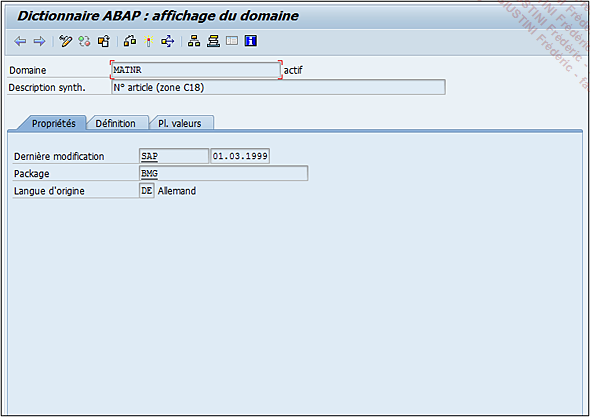

# **`PROPRIETES`**

> 
>
> Le premier volet (Propriétés - voir copie d’écran précédente) regroupe des informations diverses comme l’utilisateur et la date de la dernière modification, la langue d’origine et la classe de développement (Package).
>
> Pour rappel, ce dernier est un regroupement technique de plusieurs objets (table de données, structure, programme, classe, module fonction...) ayant comme facteur commun un développement spécifique. Par exemple, il y a les packages standards comme COCB regroupant tous les développements de la gestion des lots, HR pour les Ressources humaines, ou des packages spécifiques définis par chaque entreprise (par exemple ZFI pour les développements FI, ZSD pour la vente, ou bien encore ZDEV pour tous les développements sans différence).
