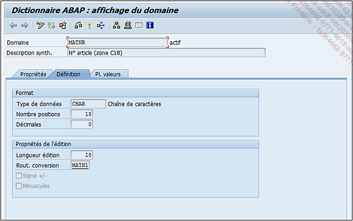
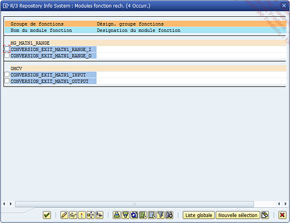
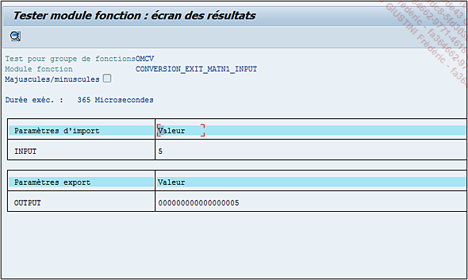

# **`TYPE DE DONNEES`**

> 
>
> On y retrouve le type de données spécifié au début de cette partie, puis vient le nombre de positions et les décimales à définir (dans le cas où le type de données permet une décimale). Dans l’exemple choisi, le nombre de positions est de 18 comme longueur d’édition, et aucune décimale étant donné qu’il s’agit ici d’une chaîne de caractères. Tout en bas de l’écran viennent deux cases à cocher :
>
> - Signe +/- si le champ utilisant le domaine a besoin d’afficher le signe négatif d’un nombre ;
> - Minuscules si le champ texte doit être affiché uniquement en minuscules.
>
> Il est également possible de définir une routine de conversion. Cette routine sera exécutée automatiquement lorsque le champ utilisant ce domaine sera mis à jour. Ici, cette routine de conversion contient les modules fonctions suivants (un double clic est suffisant pour en voir les détails) :
>
> 
>
> Ces fonctions permettent d’ajouter ou de retirer des 0 sur la gauche sur une valeur unique ou un intervalle.
>
> Exemple avec la fonction CONVERSION_EXIT_MATN1_INPUT :
>
> 
>
> Dans le cas du n° d’article, cette fonction complétera la valeur d’autant de 0 que nécessaire afin d’arriver au nombre de positions de 18 : 123456789 deviendra 000000000123456789. Très utile pour homogénéiser les données, les gérer...
