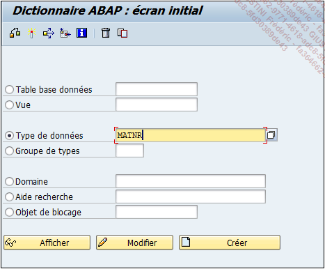

# **`ELEMENTS DE DONNEES`**

> Le `domaine` est la `caractéristique technique` d’un `champ` d’une table, cependant il existe une autre couche afin d’en compléter sa définition : l’`élément de données`. Celui-ci est tout simplement l’`objet` qui va définir le `visuel du champ` (`titre`, `nom des colonnes`...) et quelques caractéristiques additionnelles (aide à la recherche...).
>
> Pour continuer avec l’exemple du code article, l’élément de données associé se nomme également `MATNR` (il n’est pas rare de rencontrer un nom de domaine identique à celui de l’élément de données). Pour l’afficher, la transaction `SE11` doit être exécutée à partir de la zone de commande ou par le menu `SAP` de l’écran d’accueil. Une fois sur l’écran de gestion du `dictionnaire ABAP`, il suffit de cocher l’option `Type de Donnée`, puis de renseigner le nom de l’objet. Un clic sur le bouton `Afficher` va permettre d’accéder au détail de l’objet.

### **DOCUMENTATION & DOCUMENTATION COMPLEMENTAIRE**

> Comme pour le `domaine`, l’`écran de gestion de l’élément de données` est composé d’une barre d’outils quasiment identique. La différence majeure réside dans la présence de deux nouveaux boutons : `Documentation` et `Documentation complémentaire`.
>
> Ils permettent de créer une aide pour l’élément de données créé.

> Suivent ensuite quatre onglets :
>
> - Propriétés
> - Type données
> - Propriétés supplémentaires
> - Description de zone
