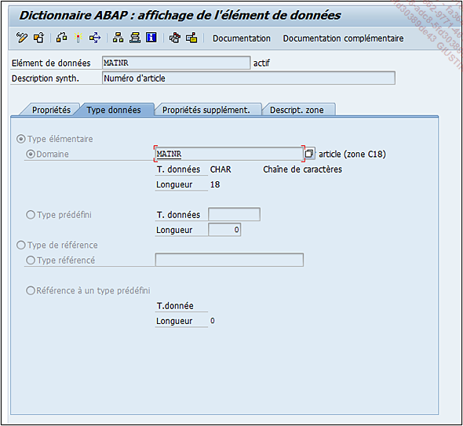

# **`ELEMENT DE DONNEES - TYPE DE DONNEES`**

> 
>
> Elle peut être définie par :
>
> - `Type élémentaire`, à savoir un domaine ou directement un type de données avec sa longueur de champ. Cette dernière option est plus utilisée pour des textes dont la valeur n’a pas besoin d’être vérifiée dans une plage de valeurs définie par un domaine.
> - `Type de référence` : plus utilisée pour l’`ABAP Objet` où le type de référence peut être une classe, une interface... ou un type de données et sa longueur afin de définir un type de référence.
