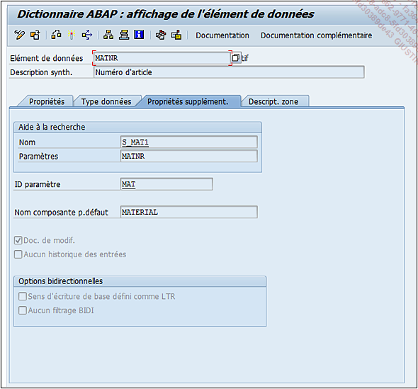

# **`ELEMENT DE DONNEES - TYPE DE DONNEES`**

> 
>
> Il est possible d’y définir :
>
> - Une `aide à la recherche`.
> - Un `identifiant de paramètre` (`ID paramètre`) : il s’agit de définir une mémoire système où grâce aux commandes `SET` et `GET`, il est possible de stocker une valeur consultable dans plusieurs transactions différentes. Par exemple, lorsque l’utilisateur crée un `code articl`e avec la transaction `MM01`, en exécutant la transaction `MM03` pour en vérifier les informations, il verra que l’écran initial sera automatiquement renseigné avec le nouveau code article. La commande `SET` aura été exécutée pendant la `MM01` (stockage du code article dans la mémoire système grâce à l’instruction `SET MAT = n° article`) et un `GET` à l’exécution de la `MM03` (lecture de cette mémoire système avec l’instruction `GET MAT = n° article`) .
> - `Nom composante p.défaut` est une proposition d’appellation générique pour les tables ou structures. Ce nommage n’est pas du tout obligatoire et il est surtout trouvé dans des tables ou structures de développements spécifiques (`BAPI...`).
> - `Doc. de modif.` (pour documents de modification) permet de mettre à jour des `tables de log` à chaque fois qu’un champ utilisant cet élément de données est créé, modifié, ou supprimé.
> - `Aucun historique des entrées` : active ou désactive le mécanisme permettant de lister l’historique des valeurs déjà utilisées. Par exemple si un utilisateur a déjà consulté trois codes article, lorsqu’il retournera à la transaction MM03, une liste contenant ces trois codes lui sera proposée lorsqu’il devra saisir l’article à consulter .
> - `Options bidirectionnelles` : cette option définit si le sens d’écriture est de gauche à droite (Sens d’écriture de base défini comme `LTR`, `LTR` signifiant `Left To Right` de gauche à droite) ou si aucun filtrage bidirectionnel ne doit être utilisé (Aucun filtrage `BIDI` pour `BI-DIrectional`).
>   Ces dernières options sont le plus souvent utilisées pour des langues ayant une lecture différente que celle de gauche à droite (arabe, hébreux...).
