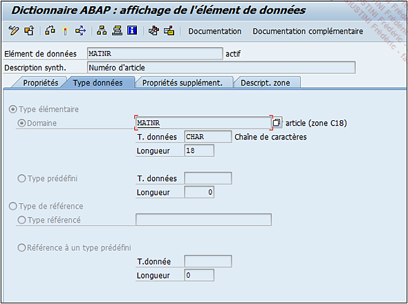
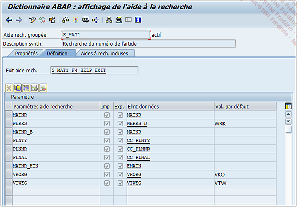
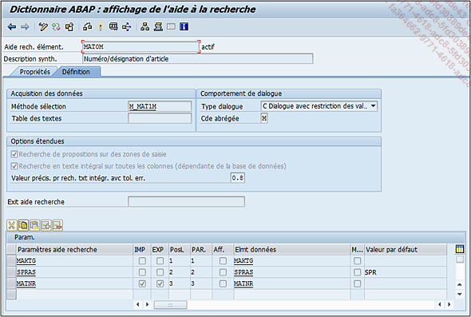
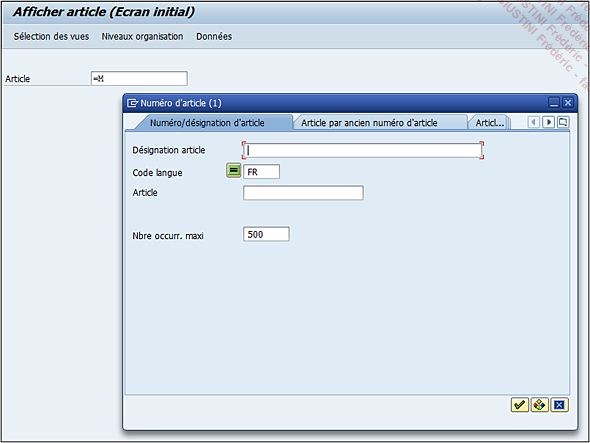

# **`AIDE A LA RECHERCHE - NAVIGATION`**

> Il est possible de `naviguer entre les objets` cités précédemment soit en double cliquant sur ceux-ci soit en choisissant l’`option Naviguer` en bas de la fenêtre. Comme l’aide à la recherche n’a pas été renseignée dans ce cas-ci, il va falloir passer par l’élément de données. Un `double clic` permettra d’afficher le détail de celui-ci.
>
> 
>
> Comme vu dans la section précédente, les informations de l’aide à la recherche se situent dans l’onglet `Propriétés supplémentaires`. Là encore, un `double clic` est nécessaire pour afficher le détail et arriver à la fenêtre de gestion de l’aide à la recherche.
>
> 
>
> La procédure suivie pour arriver à cette fenêtre est différente de ce qui a été vu précédemment, mais si le nom de l’aide à la recherche est connu d’avance, il est possible d’y accéder via la transaction `SE11`, de cliquer sur l’option `Aide à la recherche`, puis d’entrer son nom (`S_MAT1` pour cet exemple).
>
> Ici, pas de nouveauté concernant la barre d’outils, il ne s’agit que de fonctionnalités déjà vues. L’aide à la recherche `S_MAT1` est de type groupée. Il en existe deux types :
>
> 1. `Élémentaire` : liée à une table et c’est ce type qui va retourner les valeurs .
> 2. `Groupée` : qui rassemble plusieurs aides à la recherche sur plusieurs niveaux.
>
> Chaque aide à la recherche groupée est toujours composée d’élémentaires.
>
> Ainsi `S_MAT1` se définit de la façon suivante (onglet `Définition`) :
>
> - Il utilise l’`exit S_MAT1_F4_HELP_EXIT`. Un `exit` sur `SAP` (sortie en français) est un moyen pour sortir du traitement en cours, pour effectuer une tâche spécifique. Dans un programme standard, un `exit` est utile pour sortir de l’algorithme du standard afin d’y inclure des règles ou des modifications spécifiques. Dans le cas de l’aide à la recherche, il peut être utile de faire une présélection des données. Si, par exemple, dans la `MM03` se trouvait un champ Pays renseigné avec `FR`, l’`exit` proposerait tous les produits disponibles en France et l’aide à la recherche les listerait .
> - Une autre partie de l’écran affiche des `paramètres` qui ne sont pas très parlants dans le cas d’une aide à la recherche groupée.
>
> C’est dans le troisième onglet que sont listées toutes les autres aides à la recherche associée à la première. Toujours dans l’exemple, il s’agit de `S_MAT1_APPEND`. En double cliquant dessus pour en connaître son détail, il apparaît que celle-ci aussi est définie comme une aide à la recherche groupée. Ainsi, il va falloir remonter toutes les aides à la recherche groupée jusqu’à arriver à une élémentaire. En prenant à chaque fois la première, on arrive à l’élémentaire `MAT0M`.
>
> 
>
> Plusieurs paramètres définissent l’aide à la recherche élémentaire, à savoir :
>
> - `Acquisition des données` regroupant :
>
>   - Une `Méthode de sélection` : soit une table, soit une vue (comme `M_MAT1M` dans l’exemple de `MAT0M`) qui contient les `données de référence`.
>   - Une `Table des textes` contenant une `description d’un champ` d’une autre table. Par exemple, la table `MARA` contient tous les codes article. Elle est associée à une table texte (`MAKT`) qui emmagasine la description de chaque article dans toutes les langues.
>
>         Une vue est un ensemble de champs provenant de tables diverses, associées entre elles par une clé commune. Dans cet exemple, la vue `M_MAT1M` est utilisée. Elle regroupe des champs de la table `MARA` plus quelques-uns de sa table texte `MAKT`.
>
> - `Comportement de dialogue` sont des options relatives à l’écran de l’aide à la recherche comme :
>   - `Type de dialogue` dont la valeur peut être la suivante :
>     - `Affichage de valeurs immédiat` qui comme son nom l’indique affichera dans une fenêtre toutes les données disponibles de la table ou la vue définie comme méthode de sélection. Cette option est choisie lorsqu’il n’y a pas beaucoup d’entrées.
>     - `Dialogue avec restriction des valeurs` affichera tout d’abord une boîte de dialogue permettant à l’utilisateur de restreindre sa sélection en renseignant un filtre (pays, organisation commerciale, entreprise...). Cette option est utile lorsque le nombre d’entrées est très important.
>     - `Dialogue dépendant de l’ensemble de valeurs` choisira l’option la plus adéquate : si le nombre d’entrées est inférieur à 100, alors l’aide à la recherche affichera toutes les entrées sinon elle ouvrira une boîte de dialogue pour restreindre la sélection.
>   - `Cde abrégée` est un identifiant utilisé comme raccourci pour appeler une aide à la recherche élémentaire. Pour poursuivre l’exemple du champ Article de la transaction MM03, l’aide à la recherche associée est composée de nombreuses élémentaires. D’autre part, le code lié à celui du Numéro/désignation d’article (MAT0M) est défini par la lettre M. Ainsi dans le champ de l’article, il suffit d’écrire =M puis la touche `[F4]`, afin que la boîte de dialogue de l’aide à la recherche MAT0M s’ouvre automatiquement.
>
> 
>
> - `Options étendues`
>   - `Recherche de propositions` sur des zones de saisie.
>   - `Recherche en texte intégral sur toutes les colonnes`, ces deux derniers paramètres affichent l’aide à la recherche élémentaire directement à la saisie de l’article. Bien évidemment, un seul peut être défini ainsi et en consultant les autres, il s’avère que cette option est désactivée.
>   - `Valeur précision pour recherche texte intégral avec tolérance d’erreurs`, valeur comprise entre 0,1 et 1, va ajuster une tolérance d’erreur lors d’une requête sur une zone texte prenant ainsi en compte les fautes d’orthographe, de frappe... Une valeur égale à 0,1 aura une très grande tolérance sur les erreurs alors qu’une valeur 1 cherchera une occurrence exacte. Ce champ est égal à 0,8 par défaut.
> - `Exit aide à la recherche` définit un exit comme il a été vu dans les paramètres de l’aide à la recherche groupée .
> - `Paramètres aide recherche`, enfin, va lister tous les champs à utiliser. Ils sont définis par :
>   - `Nom du champ de la table` ou la vue définie dans la méthode de sélection.
>   - `IMP` le définissant comme paramètre d’import.
>   - `EXP` le définissant comme paramètre d’export.
>   - `PosL` définit l’ordre des champs dans la fenêtre des valeurs de la recherche.
>   - `PAR. définit` l’ordre des champs dans la boîte de dialogue utilisée pour restreindre la sélection des occurrences.
>   - `Aff.` indique si le champ doit apparaître ou non dans la boîte de dialogue utilisée pour restreindre la sélection des occurrences.
>   - `Elément de données` associé au champ.
>   - `M` pour modifier, est une option permettant de choisir un autre élément de données. Par défaut, celui-ci est automatiquement importé du champ de la table ou de la vue définie dans la méthode de sélection. Avec ce paramètre, le développeur peut en définir un autre.
>   - `Valeur par défaut` : comme son nom l’indique, déterminera si un champ contient une valeur par défaut. Ici, la valeur par défaut du champ SPRAS (code langue) est en fait l’identifiant paramètre de l’élément de donnée SPRAS, défini donc comme la langue de connexion (FR).
