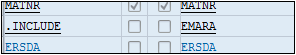

# **`INCLUDE`**

Deux notions très importantes du `DDIC` sont : l’`include` (pouvant être traduit par `inclusion` en français) et l’`append` (`ajout`) de structure. Ces deux notions ont le même but, qui est de rajouter des champs supplémentaires.

L’`include` et l’`append` sont aussi bien utilisés pour une `table` que pour une `structure`. Ce qui sera traité maintenant vaut donc également pour les structures du `DDIC`.

- `Include de structure` : additionne les champs venus d’une structure existante. Par exemple, la table `MARA`, utilise l’`include EMARA` pour insérer tous les champs existants de cette structure. Ainsi si cette dernière est mise à jour (suppression, ajout ou modification de champs), la table `MARA` sera impactée et subira automatiquement cette même actualisation.

Lors de l’utilisation d’un `include` ou d’un `append`, les champs listés sont de couleur bleue, signifiant qu’ils ne sont pas directement liés à la table mais qu’ils font partie d’un ensemble extérieur.

Même si cette modification reste propre à la table ou structure, il est possible d’imaginer, pour reprendre l’exemple de la table `MARA` et de son include `EMARA`, le degré d’impact qu’aurait l’ajout d’un append de structure à cette dernière. Il resterait local mais aurait automatiquement des répercussions sur la table `MARA`.

> L’`include` et l’`append` sur des structures ou tables standards sont des cas très sensibles du `DDIC` qui doivent être manipulés avec beaucoup de précaution.
