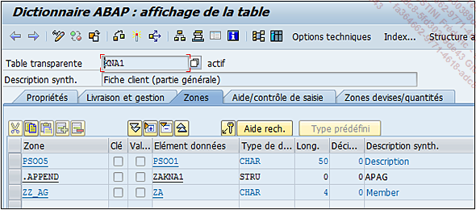

### **APPEND**

> Deux notions très importantes du `DDIC` sont : l’`include` (pouvant être traduit par `inclusion` en français) et l’`append` (`ajout`) de structure. Ces deux notions ont le même but, qui est de rajouter des champs supplémentaires.
>
> L’`include` et l’`append` sont aussi bien utilisés pour une `table` que pour une `structure`. Ce qui sera traité maintenant vaut donc également pour les structures du `DDIC`.
>
> - `Append de structure` : ajoute des champs supplémentaires mais reste cependant propre à la table ou structure. En effet, si pour un traitement spécifique, il est nécessaire de stocker une information dans une table standard, l’idée serait alors de créer un nouveau champ sauf que comme il s’agit d’une table standard, `SAP` bloque sa modification (pour des raisons de sécurité et de stabilité de la solution). Il est cependant possible de le rajouter via une structure append. Ainsi, la structure initiale n’est pas touchée par cette modification qui reste localisée dans une structure bis annexée.
>
> Par exemple, la table standard `KNA1` regroupant les données des clients, utilise un append de structure de `type Z`. Comme indiqué précédemment, il était nécessaire d’ajouter un champ supplémentaire pour un développement spécifique dans cette table. Ici, il s’agit d’un numéro spécifique à l’entreprise non pris en compte par `SAP` et nécessaire pour la fiche client.

> Lors de l’utilisation d’un `include` ou d’un `append`, les champs listés sont de couleur bleue, signifiant qu’ils ne sont pas directement liés à la table mais qu’ils font partie d’un ensemble extérieur.
>
> Même si cette modification reste propre à la table ou structure, il est possible d’imaginer, pour reprendre l’exemple de la table `MARA` et de son include `EMARA`, le degré d’impact qu’aurait l’ajout d’un append de structure à cette dernière. Il resterait local mais aurait automatiquement des répercussions sur la table `MARA`.
>
> L’`include` et l’`append` sur des structures ou tables standards sont des cas très sensibles du `DDIC` qui doivent être manipulés avec beaucoup de précaution.
