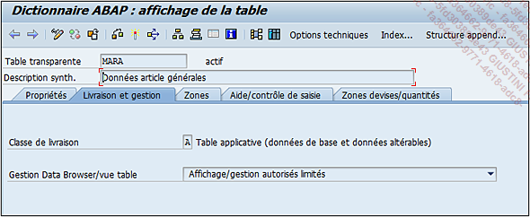
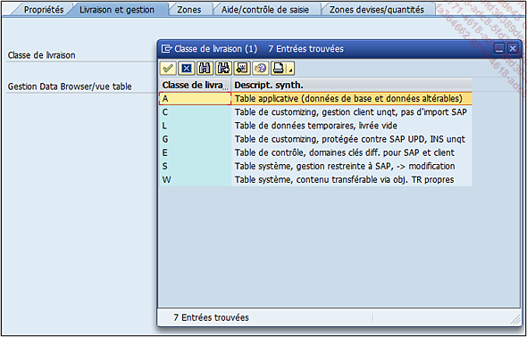
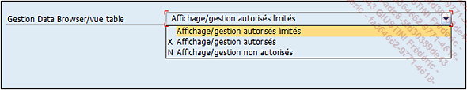

# **`TABLES - LIVRAISON ET GESTION`**

> Vient ensuite l’onglet `Livraison et gestion` où figure le type même de la table.

> Dans le chapitre traitant du `mandant SAP`, un type de table a été évoqué : la table de `customizing`. En fait, il existe plusieurs types à savoir :

> - `A - Table applicative` (données de base et données altérables) : contient des données modifiables dans chaque système de connexion. La table MARA par exemple est de ce type, ainsi ses données sur le système de développement sont différentes de celle de la production car l’utilisateur peut créer directement un article en production sans pour autant le répliquer sur le système de développement.
>
> - `L - Table de données temporaires`, livrée vide  : utile pour la gestion de données qui doivent être utilisées dans plusieurs programmes différents mais qui n’ont pas vocation à rester : par exemple, création des données dans l’un et suppression après utilisation dans l’autre...
>
> - `G - Table de customizing`, protégée contre SAP UPD, INS unqt : table de customizing où les données ne peuvent pas être mises à jour ni supprimées, mais uniquement insérées. Ces tables en général sont celles qui ne possèdent pas de nombreux changements comme par exemple la table des codes ISO pour les unités de mesure (T006I) .
>
> - `E - Table de contrôle, domaines clés diff.` pour SAP et client est une autre table de customizing réagissant comme une table applicative (de type A) mais dont les données seront écrasées lors d’une mise à jour complète de SAP (upgrade). Par exemple, la table T005 contenant la liste des pays, possède le champ ADDRS utilisant un domaine du même nom. Les valeurs de celui-ci (cf. section Les domaines) sont contenues dans la table T005A (routines d’adresse) déjà installée avec des données par défaut. Un utilisateur peut les modifier mais après un upgrade, elles seront perdues.
>
> - `S - Table système`, gestion restreinte à SAP, -> modification  : les données ne peuvent être modifiées que par SAP comme la table des codes de langue T002 dont les données sont impossibles à altérer sauf lors d’un upgrade.
>
> - `W - Table système`, contenu transférable via obj. TR propres  : il s’agit d’une table système dont les données sont transférées par des objets de transfert propres. Exemple : la table TADIR contient les objets SAP (programmes, classes, includes...) existants et dont le contenu sera modifié lors de leur création (ceux supprimés sont toujours contenus dans cette table mais avec une information de suppression).
>
> En général, les classes de livraison les plus utilisées pour un développement spécifique, sont les `classes A` (`Applicative`) et `C` (`Customizing`).
>
> Ensuite l’option Gestion Data Browser/vue table indique si les données d’une table peuvent être modifiables ou non dans le navigateur de données (Data Browser) exécutable avec la transaction SE16 ou SE16N.

