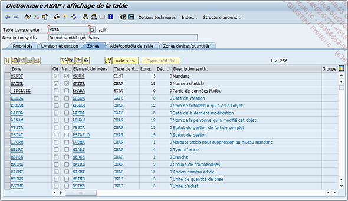
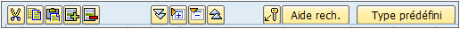
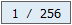

# **`TABLES - ZONES`**

> 
>
> On y retrouve tout d’abord une nouvelle `barre d’outils` propre à la gestion des champs :
>
> 
>
> - Les fonctions d’édition basique des trois C à savoir `Couper`, `Copier` et `Coller` (la ligne doit être sélectionnée au préalable).
> - `Insérer ligne`
> - `Supprimer ligne `
> - `Développer tout` permet d’ouvrir et de voir tous les champs des includes et des appends de la structure ou de la table.
> - `Décomprimer include` permet d’ouvrir et de voir tous les champs d’un include ou d’un append sélectionné au préalable, de la structure ou de la table.
> - `Comprimer include` permet de fermer et de masquer tous les champs d’un include ou d’un append sélectionné au préalable, de la structure ou de la table.
> - `Comprimer tout` permet de fermer et de masquer tous les champs des includes et des appends de la structure ou de la table.
> - `Clés externes` fait le lien entre le champ et une table de valeurs. En cliquant sur ce bouton, SAP va automatiquement importer les informations contenues dans le domaine (cette partie sera un peu plus détaillée dans un exemple à la fin de ce chapitre).
> - `Aide à la recherche` permet d’en attribuer un manuellement si celui-ci n’a pas été configuré dans un élément de données.
> - `Type prédéfini` laisse au développeur le choix de renseigner directement les types, longueur, décimales, et description d’un champ, au lieu d’utiliser un élément de données.
>
> À la fin de la barre d’outils se trouve un `compteur de champs` défini par le numéro de la ligne lue / nombre de zones au total.
>
> 
>
> Sous cette barre d’outils se trouve donc la liste des champs de la table définis par :
>
> - Un `nom de champ` (appelé ici Zone).
> - `Clé` : indiquant si le champ est une clé ou non. Dans une table de données, une clé va définir les champs ne devant pas avoir les mêmes valeurs. L’exemple de la table MARA présente deux champs clés : le mandant (MANDT) et le numéro d’article (MATNR). Ainsi, il est impossible de créer deux numéros d’article identiques dans le même mandant, SAP bloquera automatiquement et retournera un message d’erreur, voire dans certaines situations un dump.
> - `Valeurs init.` autorise ou non une valeur nulle pour la zone (coché : valeur nulle interdite, décoché : valeur nulle autorisée).
> - `Eléments de données` remplissant automatiquement les champs Type de données, Longueur, Décimales, et Description synthétique (sauf si le développeur a choisi de définir la zone manuellement avec l’option Type prédéfini).
> - `Groupe` est spécifique aux includes et permet de leur attribuer un groupe.
>
> La première zone définit si la table est mandant-dépendante (champ `MANDT` absent), ou intermandant (`MANDT` présent).
