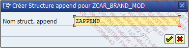
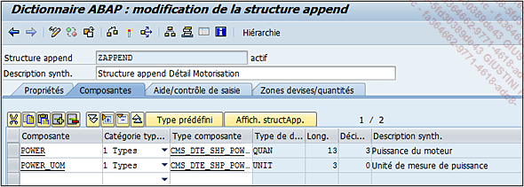
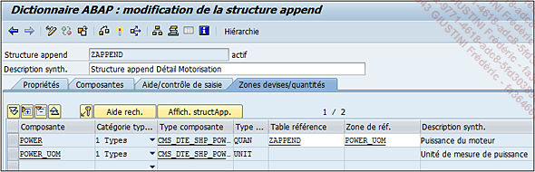
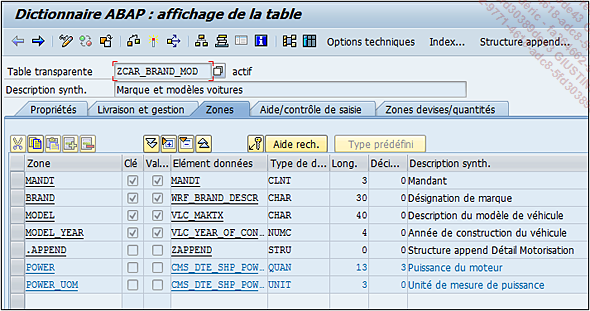
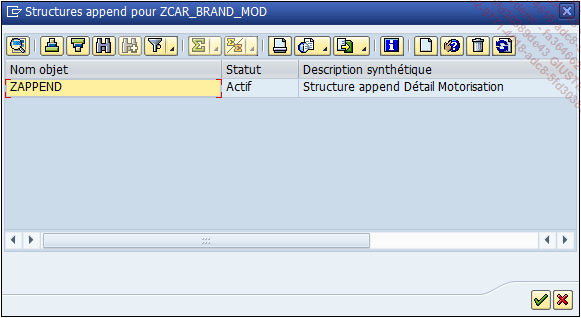

# **`STRUCTURE - CREATION D'UN APPEND`**

> Au lieu de voir comment créer une structure, il serait mieux d’étudier la création d’un `append` de structure dans une table combinant ainsi les deux éléments.
>
> Pour cela, la table `ZCAR_BRAND_MOD`, créée à la section `DDIC` de table, sera utilisée. Un `append` de structure lui sera associé et contiendra deux champs supplémentaires : un sur la puissance du moteur et un autre sur l’unité de mesure de la puissance.
>
> - Exécuter la transaction `SE11`.
> - Cocher l’option Table base de données, renseigner `ZCAR_BRAND_MOD` et cliquer sur le bouton `Afficher ou Modifier` (le choix n’a pas d’importance dans ce cas).
> - Cliquer sur le bouton Structure `Append`.
> - Une fenêtre pop-up va apparaître afin d’indiquer le nom de la structure append comme par exemple `ZAPPEND`.
>
> 
>
> - L’écran de création d’une structure va alors apparaître. Indiquer une description brève (’Structure append Détail Motorisation’ par exemple).
> - Dans l’onglet Composantes, insérer les champs suivants en respectant les informations données :
>
> | **Composante** | **Catégorie typage** | **Type composante**   |
> | -------------- | -------------------- | --------------------- |
> | `POWER`        | Types                | CMS_DTE_SHP_POWER     |
> | `POWER_UOM`    | Types                | CMS_DTE_SHP_POWER_UOM |
>
> 
>
> - Dans l'onglet `Zones devises/quantités`, indiquer la table et la zone de référence du champ `POWER`.
>
> 
>
> - Indiquer une extension avec le menu `[Autres fonctions]` - `[Catégorie d’extension...]` (la définir en `Extensible sans restriction` par exemple).
> - `Sauvegarder` puis `activer`.
> - Revenir à la gestion de la table (via la touche raccourci-clavier `[F3]` ou le bouton vert de retour arrière de la barre de commande).
> - De retour à la table `ZCAR_BRAND_MOD`, l’append apparaît bien en fin de liste, et en utilisant la fonction `Développer tout`, le champ de l’append apparaît.
>
> 
>
> Cliquer à nouveau sur le bouton `Structure append` pour faire apparaître tous ceux créés pour la table.

> Dans la barre d'outils, deux fonctionnalités sont à connnaître :
>
> 
>
> - L'icône représentant une feuille blancge pour créer une structure d'`append`
> - L'icône de la poubelle pour la supprimer
