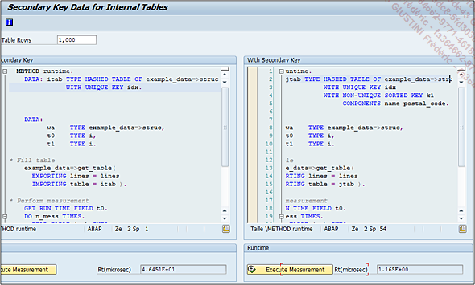

# **``**

```JS
... {UNIQUE HASHED}|{UNIQUE SORTED}|{NON-UNIQUE SORTED}
    KEY key_name COMPONENTS comp1 comp2 ...
```

> Trois type de clés secondaires sont permises :
>
> - `UNIQUE HASHED`: pour une clé secondaire de type `HASHED` et donc de caractéristique unique (enregistrement de doublons impossible) et pour laquelle il n'existera pas d'index.
> - `UNIQUE SORTED`: pour une clé secondaire de type `SORTED` avec la possibilité de la déclarer unique (enregistrement de doublons impossible) et pour laquelle un index existe.
> - `NON-UNIQUE SORTED` pour une clé secondaire de type `SORTED` avec la possibilité de la déclarer non unique (enregistrement de doublons possible) et pour laquelle un index existe.
>
> Une fois le type de clé secondaire défini, un `nom` peut lui être attribué (`key_name`) ainsi que la `liste des composants` qui la définissent (`comp1`, `comp2`...).
>
> Exemple :

```JS
TYPES: BEGIN OF ty_citizen,
         country TYPE char3,
         name    TYPE char20,
         age     TYPE numc2,
       END OF ty_citizen.

DATA: t_citizen TYPE SORTED TABLE OF ty_citizen
          WITH NON-UNIQUE    KEY country name
          WITH UNIQUE HASHED KEY key2 COMPONENTS name age.
```

> La référence `TY_CITIZEN` est créée contenant trois champs :
>
> - `COUNTRY` de type `CHAR3`
> - `NAME` de type `CHAR20`
> - `AGE` de type `NUMC2`
>
> La table interne `T_CITIZEN` est enseuite déclarée de type `SORTED` ayant une clé primaire non unique définie par les champs `COUNTRY` et `NAME`. Elle possède également une clé secondaire de type `HASHED` et donc unique, de nom `KEY3` et définie par les champs `NAME` et `AGE`.
>
> Ainsi, lorsque les données seront renseignées, il sera possible d’insérer des doublons pour la combinaison de champs `COUNTRY` / `NAME`, mais doublon impossible pour la combinaison de champs `NAME` / `AGE`. Individuellement, il n’y a pas de restriction pour les champs `NAME`, `AGE` et `COUNTRY`. Chacun d’eux pourra avoir des données en doublon. C’est essentiellement la combinaison des champs qui est importante ici.
>
> Il est possible également de nommer la `clé primaire` :

```JS
TYPES: BEGIN OF ty_citizen,
         country TYPE char3,
         name    TYPE char20,
         age     TYPE numc2,
       END OF ty_citizen.

DATA: t_citizen TYPE SORTED TABLE OF ty_citizen
          WITH NON-UNIQUE KEY primary_key COMPONENTS country name
          WITH UNIQUE HASHED KEY key2 COMPONENTS name age.
```

> Seulement elle ne pourra se nommer que `PRIMARY_KEY`, les autres valeurs (`key1` par exemple...) étant impossibles et bloquées.
>
> Le `rôle` d’une `clé secondaire` se joue dans la majorité des cas pour des `tables internes de gros volume` dont les accès en lecture sont très fréquents. Bien qu’elle puisse utiliser une grande quantité de mémoire système, elle reste très utile et rapide.
>
> Pour avoir un ordre d’idée, `SAP` met à disposition un programme appelé `DEMO_SECONDARY_KEYS`, permettant de comparer un traitement de lecture d’une table interne de type `HASHED avec une clé primaire seulement`, et d’une autre avec une `clé primaire et une clé secondaire`. Les résultats sont affichés en parallèle.



> Pour information, il est possible de créer jusqu’à quinze clés secondaires.
>
> Une notion qui revient souvent entre les types `HASHED` et `SORTED`, est celle de l’`index`.
