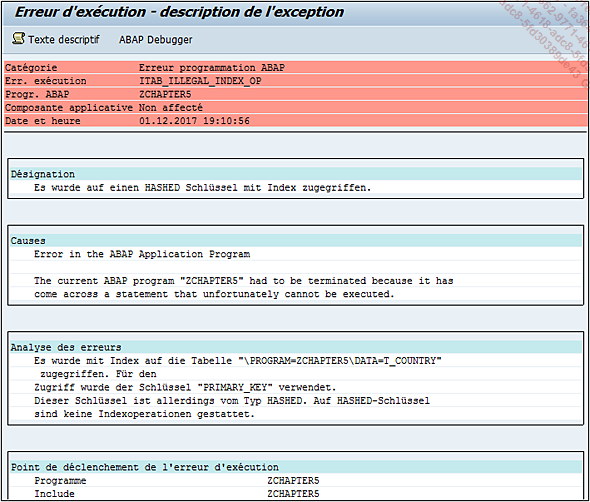

# **`MODIDFY WITH INDEX`**

> Pour l’instruction `MODIFY`, il existe trois formes de syntaxe possibles.

```JS
MODIFY itab [INDEX idx] FROM wa
            [TRANSPORTING comp1 comp2 ...].
```

L’instruction MODIFY va modifier la table interne itab à partir de la structure wa. Il est possible d’indiquer l’index de la ligne à modifier (INDEX idx) ainsi que la liste des champs à modifier (TRANSPORTING comp1 comp2...).

_Exemple_

_Reprendre l’exemple du `COLLECT` et initialiser le champ `AGE` à `10` pour la ligne 2._

```JS
TYPES: BEGIN OF ty_country,
         land   TYPE char3,
         age(3) TYPE i,
       END OF ty_country.

DATA: t_country TYPE STANDARD TABLE OF ty_country
                WITH NON-UNIQUE KEY land,
      s_country TYPE ty_country.

s_country-land = 'FR'.
s_country-age  = 23.
COLLECT s_country INTO t_country.

s_country-land = 'IT'.
s_country-age  = 20.
COLLECT s_country INTO t_country.

s_country-land = 'IT'.
s_country-age  = 55.
COLLECT s_country INTO t_country.

s_country-land = 'FR'.
s_country-age  = 5.
COLLECT s_country INTO t_country.


s_country-land = 'FR'.
s_country-age  = 10.
MODIFY t_country INDEX 1 FROM s_country TRANSPORTING age.
```

Avant le `MODIFY`, la structure `S_COUNTRY` est initialisée avec les valeurs souhaitées. Ensuite, le programme va modifier la table interne `T_COUNTRY` à l’`index 1`, à partir de la structure `S_COUNTRY`, afin de modifier uniquement le champ `AGE`.

**T_COUNTRY avant le MODIFY**

| **LAND** | **AGE** |
| -------- | ------- |
| FR       | 28      |
| IT       | 75      |

**T_COUNTRY après le MODIFY**

| **LAND** | **AGE** |
| -------- | ------- |
| FR       | 10      |
| IT       | 75      |

> Pour cet exemple, le type de table a été modifié de `HASHED` à `STANDARD`, car celui-ci n’ayant pas d’index, l’option utilisée dans le `MODIFY` générerait un `dump`.


