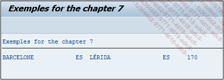

# **`WHERE ANY`**

Aussi, les trois options `ALL`, `ANY` et `OME` vont peaufiner ce critère de recherche, en vérifiant que toute la condition est respectée pour tous les registres de la sous-requête (`ALL`) ou bien en partie respectée (`SOME` et `ANY`)

_Exemple_

_Importer, dans la table interne `T_TRAVEL`, els trajets de la table `ZTRAVEK` dont le champs `KMS` (kilomètrage) est strictement inférieur ou égal à tous les kilométrages de `ZTRAVEL` définis dans une sous-requête._

```JS
SELECT city_from,
       country_from,
       city_to,
       country_to,
       kms
  FROM ztravel
  INTO TABLE @DATA(t_travel)
  WHERE kms <= ANY ( SELECT kms FROM ztravel ).


DATA s_travel LIKE LINE OF t_travel.

LOOP AT t_travel INTO s_travel.
  WRITE:/ s_travel-city_from, s_travel-country_from,
          s_travel-city_to,   s_travel-country_to,
          s_travel-kms.
ENDLOOP.
```

_Résultat à l'écran_



Cette même requête avec les options `SOME` ou `ANY`, retournerait tous les enregistrements de la table `ZTRAVEL`.
