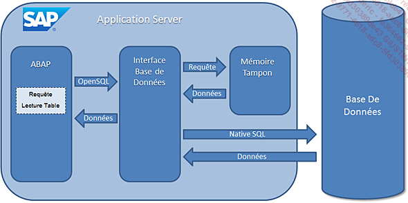
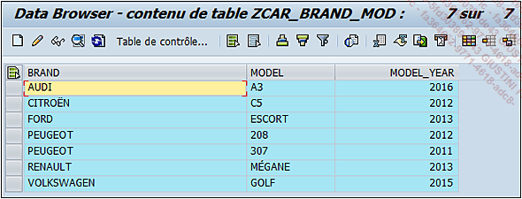
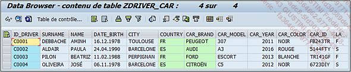
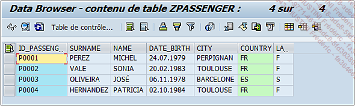
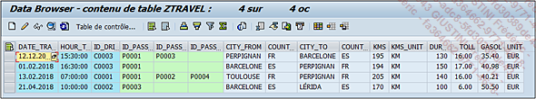

# **`SQL`**

La définition d’une table interne, faisant référence à un objet du `dictionnaire de données` (`DDIC - SE11`), a été développée, il reste maintenant à voir comment importer les données de la base de données et pour cela, `SAP` utilise le langage `SQL`.

Le `SQL` (`signifiant Structured Query Language` - requête de langage structurée en français) est tout simplement le langage de programmation permettant d’accéder et de gérer les données des `bases de données` (ajout, modification ou suppression). Pour `SAP`, il a été adapté en un ensemble d’opérations `ABAP` appelé `OpenSQL`. Pour schématiser, le traitement des données ressemblerait à ceci :

Une application `ABAP` exécute une `requête SQL`. Il s’agit d’une opération permettant de traiter directement avec la base de données, comme par exemple la lecture d’une table, qui sera alors envoyée en `OpenSQL` à une interface. Celle-ci la traduira ensuite en `Native SQL` (`langage SQL adapté pour les bases de données`) afin de consulter la base, et d’importer les informations nécessaires. Elles seront enfin retournées via l’interface à l’application `ABAP` qui pourra poursuivre son traitement.

Comme vu dans le chapitre `Dictionnaire de données` (`DDIC - SE11`), certaines tables peuvent être configurées pour l’utilisation d’une `mémoire tampon`. Ainsi les données retournées par la base de données seront stockées dans cette mémoire et consultées quand nécessaire par l’`application ABAP`.

Il existe de nombreuses instructions pour constituer une `requête SQL`.

> La suite de ce chapitre utilisera les tables créées au chapitre Dictionnaire de données (DDIC) et contiendra les registres suivants (en annexe se trouve un programme permettant de remplir rapidement les tables).

Il est possible de retrouver une petite aide pour la construction des tables dans le fichier DDIC.xlsx ainsi qu’un programme pour les remplir dans 07_CODE_DATA_TABLE.txt.

**ZCAR_BRAND_MOD**

**ZDRIVER_CAR**

**ZPASSENGER**

**ZTRAVEL**

La plupart des requêtes ci-dessous sont à retrouver dans le fichier Word 07_CODE_REQUÊTES.docx.
