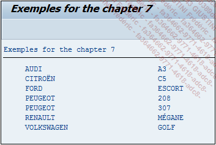
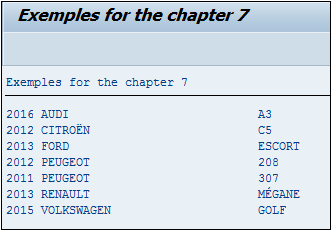
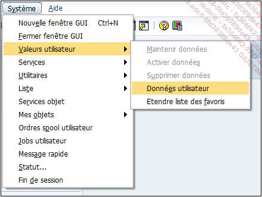
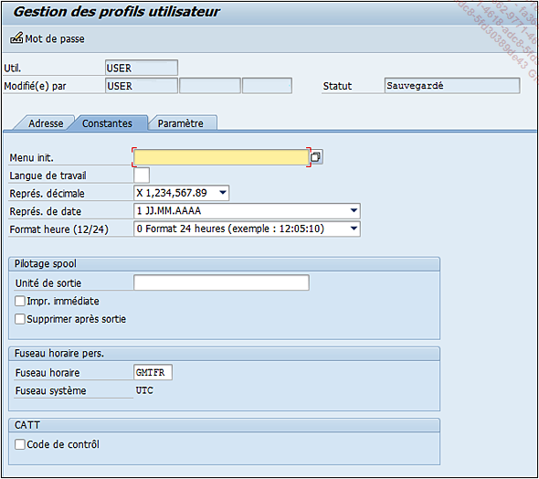

# **`INTO`**

Plusieurs types de `INTO` ont déjà été détaillés dans les parties précédentes comme :

## INTO VARIABLE

Données stockées dans une structure déclarée auparavant dans un `DATA`

```JS
INTO wa
```

## INTO TABLE

Données stockées dans une table interne déclarée auparavant dans un `DATA`.

```JS
INTO TABLE table
```

## INTO (VARIABLES...)

Donnée stockées dans les variables `obj1`, `obj2`, `obj3`... déclarés auparavant dans un `DATA`.

```JS
INTO (obj1, obj2, obj3, ...)
```

## INTO @DATA(VARIABLE)

Données stockées dans une structure déclarée directement dans la requête.

```JS
INTO @DATA(wa)
```

## INTO @DATA(TABLE)

Données stockées dans une table interne déclarée directement dans la requête.

```JS
INTO @DATA(table)
```

## INTO (@DATA(VARIABLES)...)

```JS
INTO (@DATA(obj1), @DATA(obj2), @DATA(obj3), ...)
```

## INTO CORRESPONDING FIELDS OF

Lorsque les champs du `SELECT` ne respectent pas forcément l'ordre des colonnes de la table, le `INTO CORRESPONDING FIELDS OF` va chercher et associer les bonnes valeurs avec les bons champs.

```JS
INTO CORRESPONDING FIELDS OF wa
INTO CORRESPONDING FIELDS OF TABLE table
```

_Exemple_

```JS
DATA: t_brand_mod TYPE TABLE OF zcar_brand_mod.
FIELD-SYMBOLS: <fs_brand_mod> TYPE zcar_brand_mod.

SELECT model_year,
       brand,
       model
  FROM zcar_brand_mod
  INTO TABLE @t_brand_mod.

LOOP AT t_brand_mod ASSIGNING <fs_brand_mod>.
  WRITE:/ <fs_brand_mod>-model_year, <fs_brand_mod>-brand,
          <fs_brand_mod>-model.
ENDLOOP.
```

La table `T_BRAND_MOD` est une table interne ayant pour référence la table `ZCAR_BRAND_MOD`. La requête va ensuite sélectionner les champs `MODEL_YEAR`, `BRAND`, et `MODEL` et les stocker dans celle-ci.

_Résultat de la requête_

| **MANDT** | **BRAND**  | **MODEL** | **MODEL_YEAR** |
| --------- | ---------- | --------- | -------------- |
| 201       | AUDI       | 13        | 0000           |
| 201       | CITROEN    | C5        | 0000           |
| 201       | FORD       | ESCORT    | 0000           |
| 201       | PEUGEOT    | 208       | 0000           |
| 201       | PEUGEOT    | 307       | 0000           |
| 201       | RENAULT    | MEGANE    | 0000           |
| 201       | VOLKSWAGEN | GOLD      | 0000           |

_Résultat à l'écran_



La requête va donc remplir la table des colonnes de la gauche vers la droite alors qu'avec l'option `INTO CORRESPONDING FIELDS OF`, il va la remplir correctement.

```JS
DATA: t_brand_mod TYPE TABLE OF zcar_brand_mod.
FIELD-SYMBOLS: <fs_brand_mod> TYPE zcar_brand_mod.

SELECT model_year,
       brand,
       model
  FROM zcar_brand_mod
  INTO CORRESPONDING FIELDS OF TABLE @t_brand_mod.

LOOP AT t_brand_mod ASSIGNING <fs_brand_mod>.
  WRITE:/ <fs_brand_mod>-model_year, <fs_brand_mod>-brand,
          <fs_brand_mod>-model.
ENDLOOP.
```

_Résultat de la requête_

| **MANDT** | **BRAND**  | **MODEL** | **MODEL_YEAR** |
| --------- | ---------- | --------- | -------------- |
|           | AUDI       | 13        | 2016           |
|           | CITROEN    | C5        | 2012           |
|           | FORD       | ESCORT    | 2013           |
|           | PEUGEOT    | 208       | 2012           |
|           | PEUGEOT    | 307       | 2011           |
|           | RENAULT    | MEGANE    | 2013           |
|           | VOLKSWAGEN | GOLD      | 2015           |

_Résultat à l'écran_



Il en est de même lorsqu'il s'agir d'une structure de destination.

```JS
DATA: s_brand_mod TYPE zcar_brand_mod.

SELECT SINGLE model_year,
       brand,
       model
  FROM zcar_brand_mod
  INTO CORRESPONDING FIELDS OF @s_brand_mod.
```

## APPENDING

```JS
APPENDING [CORRESPONDING FIELDS OF] TABLE table
```

Cette instruction fonctionne uniquement avec une table interne et donne la possibilité d'ajouter de nouveaux résultats sans supprimer les anciens.

Par exemple, avec la requête suivante, la table interne `T_PASSENGER`, n'aura qu'une fois les enregistrement de la table `ZPASSENGER`.

```JS
SELECT surname,
       name,
       date_birth
  FROM zpassenger
  INTO TABLE @DATA(t_passenger).

SELECT surname,
       name,
       date_birth
  FROM zpassenger
  INTO TABLE @t_passenger.


DATA s_passenger LIKE LINE OF t_passenger.

LOOP AT t_passenger INTO s_passenger.
  WRITE:/ s_passenger-surname, s_passenger-name,
          s_passenger-date_birth.
ENDLOOP.
```

_Résultat de la requête_

| **SURNAME** | **NAME** | **DATE_BIRTH** |
| ----------- | -------- | -------------- |
| PEREZ       | MICHEL   | 29799724       |
| VALE        | SONIA    | 19830220       |
| OLIVIERA    | JOSE     | 19781106       |
| HERNANDEZ   | PATRICIA | 19841002       |

_Résultat à l'écran_


> A noter que la table interne `T_PASSENGER` ayant déjà été déclarée avec le `DATA` dans la première requête, il n'est pas nécessaire de la délcarer de nouveau dans la deuxième.

> Il est possible de voir que le `WRITE` va automatiquement convertir la date en format visible, défini dans les paramètre de l'utilisateur. Pour y accéder, de n'importe quelle transaction, il suffit d'aller dans le menu `Système - Valeurs utilisateur - Données utilisateur`.



Et de renseigner le format de la date désiré dans l'onglet `Constantes`, champ `Représ. de date`. Il est possible de paramétrer d'autres options comme les décimales, le format de l'heure...



Cependant, si l'option `APPENDING TABLE` est utilisée dans la deuxième requête, les enregistrements de la table `ZPASSENGER` apparaîtront deux fois dans la table interne `T_PASSENGER`.

```JS
SELECT surname,
       name,
       date_birth
  FROM zpassenger
  INTO TABLE @DATA(t_passenger).

SELECT surname,
       name,
       date_birth
  FROM zpassenger
  APPENDING TABLE @t_passenger.


DATA s_passenger LIKE LINE OF t_passenger.

LOOP AT t_passenger INTO s_passenger.
  WRITE:/ s_passenger-surname, s_passenger-name,
          s_passenger-date_birth.
ENDLOOP.
```

_Résultat de la requête_

| **SURNAME** | **NAME** | **DATE_BIRTH** |
| ----------- | -------- | -------------- |
| PEREZ       | MICHEL   | 29799724       |
| VALE        | SONIA    | 19830220       |
| OLIVIERA    | JOSE     | 19781106       |
| HERNANDEZ   | PATRICIA | 19841002       |
| PEREZ       | MICHEL   | 29799724       |
| VALE        | SONIA    | 19830220       |
| OLIVIERA    | JOSE     | 19781106       |
| HERNANDEZ   | PATRICIA | 19841002       |

_Résultat à l'écran_


De plus, l'option facultative `CORRESPONDING FIELDS OF` est utiliser de la même manière que dans la section précédente.

```JS
DATA: t_passenger TYPE TABLE OF zpassenger,
      s_passenger TYPE zpassenger.

SELECT surname,
       name,
       date_birth
  FROM zpassenger
  INTO CORRESPONDING FIELDS OF TABLE @t_passenger.

SELECT surname,
       name,
       date_birth
  FROM zpassenger
  APPENDING CORRESPONDING FIELDS OF TABLE @t_passenger.
```

_Résultat de la requête_

| **MANDT** | **ID_PASS** | **SURNAME** | **NAME** | **DATE_BIRTH** | **CITY** | **COUNTRY** | **LANG** |
| --------- | ----------- | ----------- | -------- | -------------- | -------- | ----------- | -------- |
|           |             | PEREZ       | MICHEL   | 19790724       |          |             |          |
|           |             | VALE        | SONIA    | 19830220       |          |             |          |
|           |             | OLIVEIRA    | JOSE     | 19781106       |          |             |          |
|           |             | HERNANDEZ   | PATRICIA | 19841002       |          |             |          |
|           |             | PEREZ       | MICHEL   | 19700724       |          |             |          |
|           |             | VALE        | SONIA    | 19830220       |          |             |          |
|           |             | OLIVEIRA    | JOSE     | 10781106       |          |             |          |
|           |             | HERNANDEZ   | PATRICIA | 19841002       |          |             |          |
