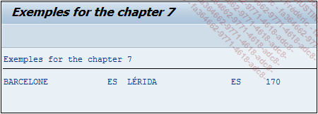

# **`WHERE... SOUS-REQUETE`**

La notion de sous-requête a été évoquée précédemment. Elle est, comme son nom l'indique, une autre requête retournant un résultat qui doit être vérifié par la condition principale.

_Exemple_

_Retourner tous les trajets dont la distance est strictement inférieure à celle du trajet le plus long._

```JS
SELECT city_from,
       country_from,
       city_to,
       country_to,
       kms
  FROM ztravel
  INTO TABLE @DATA(t_travel)
  WHERE kms < ( SELECT max( kms ) FROM ztravel ).


DATA s_travel LIKE LINE OF t_travel.

LOOP AT t_travel INTO s_travel.
  WRITE:/ s_travel-city_from, s_travel-country_from,
          s_travel-city_to,   s_travel-country_to.
ENDLOOP.
```

_Résultat de la requête_

| **CITY_FROM** | **COUNTRY_FROM** | **CITY_TO** | **COUNTRY_TO** | **KMS** |
| ------------- | ---------------- | ----------- | -------------- | ------- |
| BARCELONE     | ES               | LERIDA      | ES             | 170     |

_Résultat à l'écran_



Cette même requête avec les options [`SOME`](../09_SQL_Select/23_where_some.md) ou [`ANY`](../09_SQL_Select/23_where_any.md), retournerait tous les enregistrements de la table `ZTRAVEL`.
