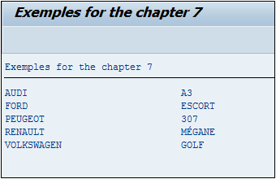

# **`WHERE COL (NOT) IN SELTAB`**

```JS
col [NOT] IN seltab
```

Pour cette fonction, le paramètre `SELTAB` signifie `selection table` (table de sélection), et est le plus souvent associé à un `champ` d'un écran de sélection de type `SELECT-OPTIONS` (pour `Options de sélection` dont la notion sera détaillé dans le chapitre de création de programme).

La particularité de ce type de `champ` est qu'il est en fait, une `table interne de type` [`Range`](../07_Tables_Internes/05_type_range_of.md).

L'exemple suivant va reprendre celui créé avec l'option `BETWEEN` : sélectionner toutes les marques et modèles de voitures dont l'année est comprise entre 2013 et 2016, plus ceux de 2011. Pour cela, une table interne de type [`Range`](../07_Tables_Internes/05_type_range_of.md) avec comme référence l'élément de données `VLC_YEAR_OF_CONSTRUCTION`, sera créée et renseignée avec toutes les options de date, afin d'être utilisée dans la clause `WHERE`.

```JS
DATA: r_year TYPE RANGE OF vlc_year_of_construction.
DATA: s_year LIKE LINE OF r_year.

s_year-sign   = 'I'.
s_year-option = 'BT'.
s_year-low    = '2013'.
s_year-high   = '2016'.
APPEND s_year TO r_year.

CLEAR s_year.
s_year-sign   = 'I'.
s_year-option = 'EQ'.
s_year-low    = '2011'.
APPEND s_year TO r_year.

SELECT brand,
       model
  FROM zcar_brand_mod
  INTO TABLE @DATA(t_car)
  WHERE model_year IN @r_year.


DATA s_car LIKE LINE OF t_car.

LOOP AT t_car INTO s_car.
  WRITE:/ s_car-brand, s_car-model.
ENDLOOP.
```

_Résultat de la requête_

| **BRAND**  | **MODEL** |
| ---------- | --------- |
| AUDI       | A3        |
| FORD       | ESCORT    |
| PEUGEOT    | 307       |
| RENAULT    | MEGANE    |
| VOLKSWAGEN | GOLF      |

_Résultat à l'écran_


